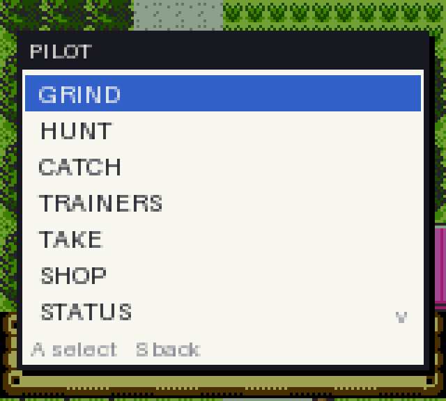
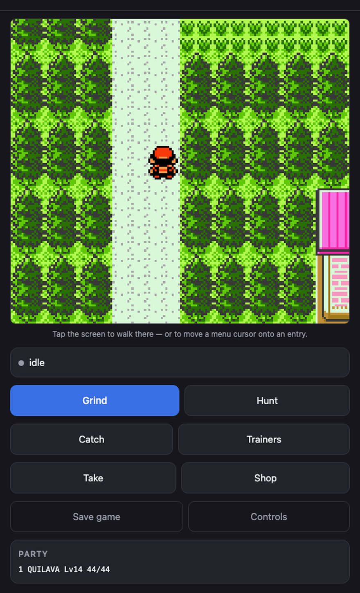
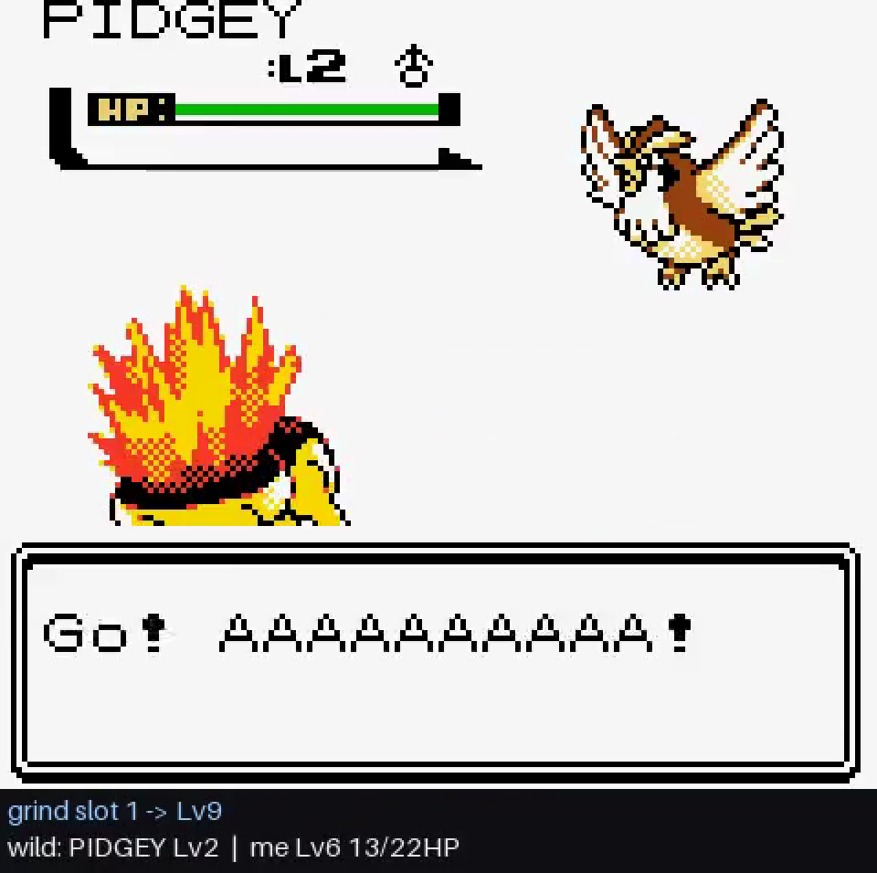
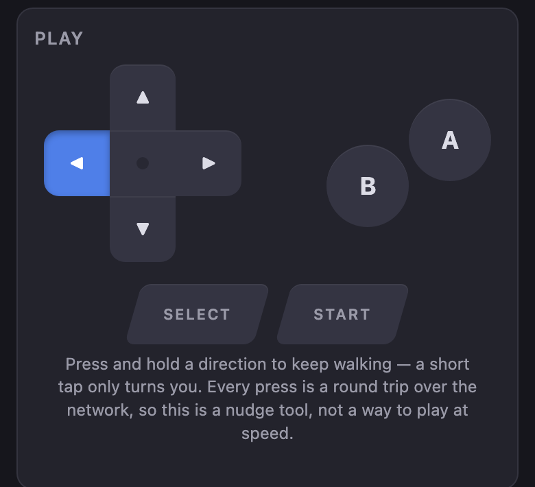

# crystal-pilot

[](https://github.com/minormending/crystal-pilot/actions/workflows/tests.yml)
[](LICENSE)
[](https://www.python.org/)

An auto-pilot for grinding in Pokémon Crystal. You point it at a party member and
a target level, and it plays the route for you — finding grass, fighting wild
Pokémon, picking sensible moves, walking to a Pokémon Center when it gets low,
and saving when it's done.

It takes a backup before every task and gives up on a timeout rather than running
forever.

```bash
crystal-pilot grind --species cyndaquil --to-level 25
```

```
grind: CYNDAQUIL Lv5 -> Lv25 on Route 29
backup: backup 'grind-CYNDAQUIL-L25' at 20260831-142320 sav=... state=...
grind: healing (12/33 HP)
  heal: ROUTE_29 -> CHERRYGROVE_POKECENTER_1F (2 hops)
  heal: healed, returning to ROUTE_29
save: committed (game wrote its save data)
done: CYNDAQUIL reached Lv25 (from Lv5) on Route 29
  battles=75  won=75  fled=0  heals=1  encounters=75  level=25  saved: yes
```

Because it runs headless at roughly 28,000 fps (≈470× real time), an hour of
grinding takes a few seconds.

### Three ways to drive it

Press **Tab** while playing and the menu draws over the game — your real party
for GRIND, and for HUNT only the species that appear on the route you are
standing on:



Or run `crystal-pilot serve` and open the URL on your phone. Here it has just
found a HOPPIP and left the battle live for you to take over:



Every run can be recorded as a sped-up video with a caption strip carrying live
state, so a three-hour grind is a minute you can actually watch:



## Requirements

- A **pokecrystal** disassembly checkout, built (`make`), giving you
  `pokecrystal.gbc` **and `pokecrystal.sym`**. The symbol file is not optional —
  it is what lets the pilot read real game state instead of guessing from pixels.
- Python 3.11+ (tested on 3.14).

## Install

```bash
cd crystal-pilot
python3 -m venv .venv && ./.venv/bin/pip install -r requirements.txt
```

Then either use `./crystal-pilot …` or `./.venv/bin/python -m pilot …`.

It looks for the disassembly at `~/projects/pokecrystal` by default. Point it
elsewhere with `POKECRYSTAL_DIR`, or per-command with `--rom` and `--source`:

```bash
export POKECRYSTAL_DIR=/path/to/your/pokecrystal
```

## Usage

### Start a game

A freshly built ROM has no save at all, so there is nothing to grind. `bootstrap`
plays the intro, picks a starter, and walks out to Route 29's grass:

```bash
crystal-pilot bootstrap --starter cyndaquil     # or totodile / chikorita
```

It does not type any names. The intro's NAME menu defaults to NEW NAME, which
opens the letter grid, and the "give it a nickname?" prompts default to YES and
open the same grid -- so an auto-pilot pressing A through the intro ends up
called AAAAA with a starter to match. Instead the bootstrap takes one of the
game's own names (`NamePlayer` stores the presets below NEW NAME directly, no
naming screen involved) and declines every nickname prompt, so Pokemon keep the
names the game gives them.

If you would rather name your own character, play the intro yourself and use
the other commands from your save; `bootstrap` exists for starting from nothing.

### Grind

```bash
crystal-pilot grind --species cyndaquil --to-level 25
crystal-pilot grind --slot 2 --to-level 30 --timeout 300
```

| Flag | Meaning |
| --- | --- |
| `--species NAME` / `--slot N` | who to train (default: slot 1). Names are fuzzy: `pikachu`, `Mr. Mime` |
| `--to-level N` | target level (required) |
| `--timeout SECONDS` | give up after this much real time (default 900) |
| `--heal-below F` | visit a Pokémon Center below this HP fraction (default 0.40) |
| `--flee-below F` | run from wild battles below this HP fraction (default 0.30) |
| `--no-evolve` | cancel evolutions instead of allowing them |
| `--learn-moves` | accept new moves that replace an existing one (default: keep the moveset) |
| `--on-timeout save\|revert` | on timeout, keep the levels gained or roll back (default `save`) |

### Hunt

Search the current route for a particular wild Pokémon, fleeing everything else.

```bash
crystal-pilot hunt --species hoppip
crystal-pilot hunt --shiny --max-encounters 2000
```

```
done: found HOPPIP Lv3 on Route 29 after 11 encounter(s)
  encounters=11  fled=10  fought=0  wall=0.5s  found=HOPPIP  level=3
  note: battle left in progress; state saved to found-HOPPIP.state
```

It stops with the battle still on screen and saves that exact moment, so you can
pick it up in `play`. `--leave` runs from it instead. Shininess is read from the
enemy's DVs using the game's own rule (Attack DV bit 1 set, Def/Spd/Spc all 10),
so `--shiny` is exact rather than a guess. If the species never turns up it says
what it *did* see, which usually means you are on the wrong route:

```
gave up (blocked): saw 40 encounters on Route 29 without finding PIKACHU
  note: seen: SENTRET x20, PIDGEY x18, RATTATA x2
```

### Catch

```bash
crystal-pilot catch --species hoppip --weaken-to 0.4
```

```
done: caught HOPPIP Lv3 on Route 29 (1 ball(s), 12 encounter(s))
```

| Flag | Meaning |
| --- | --- |
| `--species` / `--shiny` | what to catch |
| `--ball NAME` | which ball; default is the cheapest ordinary one you carry |
| `--weaken-to F` | chip it to this HP fraction first, with the *weakest* damaging move |
| `--max-balls N` | give up after this many throws (default 40) |

A Master Ball is never thrown unless you name it. `--weaken-to` deliberately
picks the weakest move available, because the usual way to lose a catch is to
knock it out. With no balls in the bag it refuses up front rather than hunting
first and failing at the throw.

### Battle every trainer on a route

```bash
crystal-pilot trainers
```

Trainers come from the map data, and the pilot walks to each one, fights it, and
heals between fights — trainer battles cannot be fled, so it starts each one
healthy (`--heal-below`, default 0.60). If a Pokémon faints it sends out the next
healthy one; if the party is wiped it stops and says so.

Reporting distinguishes three different kinds of "didn't fight it", because in
the early game they are all common and mean different things:

```
gave up (blocked): beat 0 of 3 trainer(s) on Route 30
  trainers=3  beaten=0  already_beaten=0  not_present=1  unreachable=2
  note: Youngster at (2,28) is not on the route yet (gated behind story progress)
  note: could not reach Youngster at (5,23)
```

*Not present* means the trainer's `object_event` is gated on a story flag and
they have not appeared yet — checked against the live object list, not the map
file. *Unreachable* means no walkable route exists from where you are.

### Look around

```bash
crystal-pilot status
```

```
location : Route 29 (53,12)  [on grass]
party    :
  slot 1: CYNDAQUIL Lv12 27/35HP OK [TACKLE(26), LEER(30), SMOKESCREEN(20), EMBER(25)]
nearest Center: CHERRYGROVE_POKECENTER_1F (2 hops)
```

### Play, and hand over mid-session

`play` opens a real emulator window. You play normally; when you want to grind,
type a command in the terminal and the pilot takes over, then gives the controls
back — no saving, quitting or reloading.

```bash
crystal-pilot play
```

```
grind cyndaquil 25    grind a party member on the current route
grind 25              same, for whatever is in slot 1
status / save / backup / speed <n> / help / quit
```

**Press TAB for the pilot menu**, drawn over the game itself — no terminal
needed. Arrows move, `A` chooses, `S` goes back, TAB or Escape closes.

The menu offers what makes sense where you are standing: your actual party for
GRIND, and for HUNT/CATCH only the species that appear on this route, read from
the game's own encounter tables. Progress shows on screen while a task runs, and
the result panel replaces it when it finishes.

While the menu is open the emulator stops ticking, so the game is genuinely
frozen — and because the menu reads the keyboard straight from SDL rather than
through the game's joypad, none of the keys you press in it reach the game. TAB
is used because PyBoy does not bind it; a Game Boy button combination could be
confused with something you meant to do in the game. `--no-menu` turns it off.

Typed commands still work alongside it, which is what the CLI examples above
use. Tasks dispatched either way run in a second, windowless emulator and the
state is handed back when they finish. An open window pins the emulator to a few
hundred fps, which would turn a 12-second grind into minutes.

### Control it from your phone

```bash
crystal-pilot serve
```

```
  Open this on your phone, on the same wifi:

      http://192.168.1.168:8080/?t=pilot

  The token in the URL is the only thing protecting this,
  so keep it on your own network. Ctrl-C to stop.
```

It also prints the URL as a QR code, so you can point a camera at the terminal
instead of typing an IP and a token on a phone keypad. Any phone browser works,
Android or iPhone, with nothing to install and no cable. Both devices just need
to be on the same wifi.

`--token pilot` is worth using if you are typing it: the default is random.

**Tap the screen to walk there.** The overworld is drawn in 16×16 tiles, so the
screen is 10×9 of them and the player is always the one at (4, 4) — the camera
keeps them centred rather than clamping at map edges, verified on three maps at
three different positions. That makes a tap a map coordinate, and the pilot
already has the collision map and the BFS to path to it, ledges and all. It says
so when it cannot:

```
walk to (55,9)     from (53,11) -> (55,9)
walk to (55,11)    could not reach (55,11); stopped at (55,9). Ledges are
                   one-way, and some tiles are only reachable the long way round
```

If a menu is open, the same tap puts the **cursor** on the entry you tapped
instead. It never presses A — a row misread by one would use the wrong item or
toss the wrong Pokémon, and a cursor in the wrong place is something you can see
and correct. Whether a menu is open is read from `wWindowStackSize`, which the
game pushes and pops, rather than from the menu cursor: out on the map the
cursor keeps whatever value the last menu left in it, and treating that as an
open menu would send DOWN to the player instead, walking them into the grass.

Tap **Controls** for the D-pad. It is laid out like the hardware, and the lit key
below is LEFT actually being held:



**Press and hold** a direction to walk. Gen 2 turns you before it walks you, and
the six frames this used to send were spent entirely on the turn — measured: the
first press after any change of direction moved you nowhere, and each press after
that moved exactly one tile. A press now lasts long enough to turn *and* step,
and while a finger stays down the page asks for another as soon as the last comes
back. Every press is still a round trip over wifi, so this is for nudging
yourself out of a corner and taking over a battle, not for playing at speed.

If the page will not load, it is almost always one of three things: the phone is
on a different network (guest wifi is the classic trap), the router has AP/client
isolation switched on, or macOS is asking whether to allow incoming connections
to Python.

Still wireless, in the order worth trying:

1. Put both devices on the same wifi and re-check the IP the banner prints —
   it is read from the interface holding the default route.
2. Turn off AP isolation, or use a network where you can.
3. Share the Mac's connection (System Settings → General → Sharing → Internet
   Sharing) and join the phone to it. The Mac's address changes, so restart
   `serve` to get the new URL.
4. A private mesh VPN like Tailscale puts both devices on one network without
   exposing anything publicly.

Do not port-forward this to the internet. It is a token on a plain HTTP server,
which is fine on your own network and nowhere else.

Over USB, `adb reverse tcp:8080 tcp:8080` also works, but none of the above
needs a cable.

Opens that URL on your phone and you get the game screen live, plus the same
tasks as buttons: pick a party member and a level for GRIND, or pick from the
species that actually appear on the route you are standing on for HUNT and
CATCH. Progress streams while a task runs and the result lands underneath. There
is a D-pad too, for nudging the character around — fine for that, laggy for real
play.

The Mac keeps doing the emulating, which is the point: the value here is running
headless at tens of thousands of frames a second, and a phone cannot do that.
There is no app to install.

| Flag | Meaning |
| --- | --- |
| `--port` / `--host` | default 8080, bound to all interfaces so a phone can reach it |
| `--token` | fixed token instead of a fresh random one each run |
| `--no-input` | drop the D-pad and expose tasks only |
| `--new-game` | bootstrap a new game first |

It binds to your LAN and every request needs the token, which is a convenience
for a home network — not a hardened service. Don't port-forward it.

### Watch what it did

Add `--record` to any task to get a sped-up video with a caption strip showing
what the pilot was doing at each moment.

```bash
crystal-pilot --record run.mp4 grind --species cyndaquil --to-level 25
```

```
recorded run.mp4 -- 54s of video at 60x (1,602 frames, 11.3 MB)
```

| Flag | Meaning |
| --- | --- |
| `--record FILE` | write a video (`.mp4`, or `.gif` for something small and pasteable) |
| `--record-speed N` | playback speed relative to real time (default 30) |
| `--record-fps F` | output frame rate (default 30) |
| `--record-scale S` | pixel scale; 1 is native 160×144 (default 3) |
| `--record-crf N` | H.264 quality, lower is better and larger (default 23) |
| `--no-record-hud` | drop the caption strip |

Speed matters more than it sounds. A grind is hundreds of thousands of frames —
hours of game time — so recording 1:1 would produce a video nobody watches.
`--record-speed 60` on a Lv5→Lv14 grind gives about a minute; the same run at the
default 30 gives two. Pick the speed from how long you want to sit there, and
remember any player can speed it up further.

Sampling is what keeps this cheap: only the frames that get captured are
rendered, so recording a grind costs almost nothing (13.1s versus 13.0s
unrecorded in one measured run).

In `play` mode, `--record` writes one numbered file per dispatched task
(`run-1.mp4`, `run-2.mp4`, …), recorded from the emulator that actually runs the
task.

`ffmpeg` is used when present and is what makes `.mp4` possible; without it the
recorder falls back to writing an animated GIF.

### Scrub and resume from any point

The video shows what happened; checkpoints let you act on it. Add
`--checkpoints` and the pilot writes a save state at intervals, indexed against
the video's timeline.

```bash
crystal-pilot --record run.mp4 --checkpoints grind --species cyndaquil --to-level 14
```

```
recorded run.mp4 -- 42s of video at 90x (1,249 frames, 9.9 MB)
wrote 44 checkpoints to run.timeline (0.6 MB)
```

Watch the video, note a moment, then list and jump to it:

```bash
crystal-pilot timeline run.mp4
```

```
44 checkpoints -- grind cyndaquil -> Lv14
video: run.mp4 (90x)

(* = mid-battle: resumable and playable, but the game cannot write a save there)

#0          video 0:00   Route 29  |  CYNDAQUIL Lv5 20/20HP
#5          video 0:05   Route 29  |  CYNDAQUIL Lv7 14/24HP
#7          video 0:07 * wild: SENTRET Lv3  |  me Lv8 9/26HP
#8          video 0:08   Cherrygrove City  |  CYNDAQUIL Lv8 9/26HP
```

```bash
crystal-pilot resume run.mp4 --at 0:30
```

That opens the playable window at that exact frame — including mid-battle, where
you can play the fight out yourself. `--at` accepts video seconds (`42`), `m:ss`
(`1:05`), an index (`#7`), a level (`level:12`), or `start` / `end`. Point it at
either the `.mp4` or the `.timeline` directory.

Since it lands in the normal interactive session, you can also carry on
automatically from there — `grind cyndaquil 16` at the prompt picks up from the
resumed state.

To rewind the actual save file rather than just play from a point:

```bash
crystal-pilot resume run.mp4 --at "#8" --commit --headless
```

`--commit` performs a real in-game save at that point, so the `.sav` continues
from there in any emulator. It needs a point the game can save at: Gen 2 refuses
to save mid-battle, which is what the `*` marks. Ask for one anyway and the error
names the nearest checkpoint that works and changes nothing — or add `--snap` to
go there automatically:

```bash
crystal-pilot resume run.mp4 --at level:12 --snap --commit --headless
```

```
snapped from #28 (mid-battle) to #29
resuming at #29  video 0:29  Route 29  |  TOTODILE Lv12 32/38HP
saved -- the .sav now continues from this point
```

`--snap` earns its keep with `--at level:N`, which usually lands inside the very
battle that caused the level-up.

| Flag | Meaning |
| --- | --- |
| `--checkpoints` | write save states during the task |
| `--checkpoint-dir DIR` | where (default: next to `--record`, else `<rom>-timeline`) |
| `--checkpoint-every N` | spacing: seconds of video when recording, else seconds of game time (default: one per second of video) |

A state is ~196 KB raw but gzips to about 7%, so a 44-point run costs 0.6 MB.
The cost that matters is time: taking one is ~10 ms, which is why the default is
about one per second of video rather than anything finer.

### Backups

```bash
crystal-pilot backups list
crystal-pilot backups restore --name 20260831-142320-grind-CYNDAQUIL-L25.state
```

## What it does about the things that go wrong

- **Low HP** — runs from the battle below `--flee-below`, then walks to the
  nearest Pokémon Center, heals, and returns to the exact grass patch it left.
  The route is found with a breadth-first search over the game's own map
  connections and warps, so this is not a hardcoded list of places.
- **PP running out** — moves with no PP are never chosen, and among moves of
  similar power it prefers the one with more PP left, so it doesn't drain one
  move to zero while the others sit full. When nothing damaging has PP left it
  goes to a Pokémon Center (which restores PP too) instead of falling back on
  Struggle, which would only hurt the Pokémon it's training.
- **Level-up move prompts** — declines by default, so a grind can't quietly
  replace a move you wanted. `--learn-moves` opts in.
- **Evolution** — allowed by default and reported. The target is tracked by party
  *slot*, not species, so a Cyndaquil that becomes Quilava mid-grind is still the
  Pokémon you asked to train. `--no-evolve` cancels.
- **Timeout** — the budget covers both real seconds and emulated frames. When it
  trips, the pilot leaves the battle it's in (the game cannot save mid-battle),
  saves the progress made, and says how far it got.
- **Saving** — done through the real START → SAVE → YES menu and confirmed by the
  game's own save routine firing. The pilot never reports a save the game didn't
  make. The `.sav` is a standard 32 KB Gen 2 battery save, so it works in other
  emulators and on hardware.

## Tests

```bash
./run-tests                    # everything (~72s)
./run-tests -k catch           # just the ones matching a pattern
./run-tests -v                 # notes and tracebacks
./run-tests --self-check       # prove the suite can actually fail
./run-tests --build-fixtures   # regenerate the save states it runs against
```

77 tests. Most of them exist because of a specific bug that shipped and was
invisible from the outside — the task still reported success while doing the
wrong thing. Move selection silently fell back to whatever the menu cursor was
resting on; fleeing stopped working and fought instead; a catch burned a ball it
did not count; an absent trainer was reported as already beaten. So the tests
mostly assert *what actually happened* against *what was claimed*:

```
ok  catch reports exactly the number of balls it spent
      completed: reported 1, actually spent 1
ok  the best move stays chosen across a run of battles
      6 battles; EMBER 25->19, TACKLE 35->35
```

Fixtures are gzipped PyBoy save states (~12 KB each) built by
`tests/build_fixtures.py` rather than by hand. They are **not** committed — they
contain game data — so generate them once after building your ROM:

```bash
./run-tests --build-fixtures
```

The badge at the top covers the `data-tests` job. CI has no ROM, so the 61 tests
that drive a real emulator skip themselves and the 16 that only read the
disassembly's data files run: names, move data, map connections, warps, trainers
and the timeline logic. The runner says so rather than reporting a bare pass:

```
16 passed, 61 skipped, 0 failed  (0.1s)
  skipped: ROM not found: /home/runner/pokecrystal/pokecrystal.gbc
  (61 tests need a ROM built from the disassembly)
``` Only slow-to-reach situations are
stored; being *in* a battle or having balls in the bag is set up at test time.
The runner is deliberately dependency-free — no pytest to install or remember.

**`--self-check` is the part worth knowing about.** It re-introduces each of
those bugs one at a time and checks the matching test goes red, reverting every
mutation afterwards:

```
caught  move choice counts presses instead of reading the cursor
caught  the intro is left to mash A through the NAME menu
caught  nickname prompts are answered with their default of YES
caught  collision map reads the wrong quadrant of each block
8 caught, 0 missed
```

It has already earned its keep. Two tests passed mutations they should have
caught: one only exercised a single battle, when the bug needed a second turn to
appear, and one walked uniform grass, where reading the wrong quadrant of a
block gives the right answer anyway. Both are now stronger.

Two mutations have since been dropped rather than papered over, each with the
reason recorded next to the list. One because the code genuinely self-corrects
there now, so there was no bug left to catch. The other because rebuilding the
fixtures moved the RNG out from under it: the bug needs a stray A press to land
in the exact frames where the battle menu is up, and the current fixture no
longer lines up that way. The guard it targeted stays in the code — but the
suite no longer proves it, and saying so is better than a self-check that reads
green by testing nothing.

## How it works

The interesting part is that the pilot reads the game rather than the screen.

**Symbol-driven event hooks.** `pokecrystal.sym` gives exact addresses for every
routine and variable. The pilot registers hooks on the routines the game calls
when it wants input — `BattleMenu`, `MoveSelectionScreen`, `YesNoBox`,
`SaveMenu`, `LearnMove`, `EvolveAfterBattle` — so it knows what the game is
asking for instead of inferring it from pixels. Hooks are edge-triggered on
routine entry, which shapes a lot of the design.

**Live collision map.** The loaded map's blocks live in `wOverworldMapBlocks` and
each tileset's per-quadrant collision values sit in ROM at
`wTilesetCollisionAddress`. Reading both gives the collision byte for any tile,
so movement is a breadth-first search instead of bumping into walls to find them.
The decode is *verified at runtime* against `wPlayerTileCollision` — the game
publishes the collision of the tile the player is standing on, so the pilot
checks its own arithmetic before trusting it. Pathfinding also avoids one-way
ledges, which otherwise strand you in a region with no way back up.

**Game data from source.** Species ids, move power/type/PP, map names and
walkability tables are parsed out of the pokecrystal source tree, so they cannot
drift from the ROM being driven.

### Three things that are easy to get wrong

Worth knowing if you extend this:

1. **WRAM banking.** `0xD000–0xDFFF` is switchable on CGB and Crystal really does
   switch it (banks 1, 5 and 6 all occur in normal play). Unbanked reads of that
   window return another bank's bytes for a good fraction of frames, which looks
   like random corruption of the party and battle state. Every access in
   `session.py` is bank-qualified.
2. **Menus wrap.** Normalising a cursor by pressing "up" three times does nothing
   on a 3-item wrapping list. Cursor position is read from `wMenuCursorX` /
   `wMenuCursorY` and driven to the target instead. Related: those variables hold
   the *previous* value when a menu hook fires, so readiness needs a settle
   period — otherwise directional presses land on battle text and the turn
   silently falls back to whatever move the cursor was left on.
3. **"World loaded" is not "party loaded".** The CONTINUE screen restores the
   party and coordinates *before* the map exists, so waiting on party data starts
   pressing buttons while still in the menus. `wMapStatus == MAPSTATUS_HANDLE`
   with a published map size is the real signal.

Also: PyBoy's hooks only fire for routines in low ROM banks. Everything hooked
here is in bank 0x10 or below and verified to fire; `Session` checks the bank of
each hook at startup so a future addition fails loudly instead of quietly never
firing.

## Running it on the phone itself

The web UI above keeps the emulator on your Mac. If you want the whole thing on
the device, that is a separate exploration:
**[crystal-pilot-mobile](https://github.com/minormending/crystal-pilot-mobile)**
— a browser build that boots the ROM on the phone, measured at 37x real time
against this project's 470x. It proves the platform port; the task loop there is
not yet finished.

## Limits

- **The trainer sweep is not end-to-end verified.** Its parts are — trainer
  parsing across 87 maps, presence detection, pathfinding, faint replacement,
  and the reporting above — but no trainer is reachable from an early-game save,
  so it has never been watched winning a route. Route 30's only corridor north
  is a single tile held by the scripted battle scene, and Route 46 is one-way
  downhill from Route 45. Try it on a save with some story progress, and treat
  the first run as something to watch (`--record`) rather than trust.
- **Catching does not use the PC.** With a full party it refuses rather than
  sending the catch to a box.
- **No type effectiveness.** Move choice ranks by power × accuracy, not matchup.
  Good enough to grind efficiently; not optimal play.
- **Healing needs a reachable Pokémon Center.** It walks; it doesn't use bag
  items, Fly or Teleport. If no Center is reachable the task stops cleanly and
  says so rather than fainting.
- **Trainer battles are not sought out**, and the pilot won't fight one it can't
  flee. Grinding happens on wild encounters.
- **Recording is a timelapse, not a replay.** Frames are sampled, so the video
  is a fast-forward of the run rather than a frame-exact recording. Checkpoints
  are the frame-exact part: the video is for looking, the save states are for
  resuming, and `timeline`/`resume` tie the two together.
- You need to build the ROM yourself from the pokecrystal disassembly; no ROM,
  save or save state is distributed here, and the test fixtures are generated
  locally by `./run-tests --build-fixtures`.

## Layout

```
pilot/
  session.py     PyBoy wrapper: hooks, input, bank-qualified memory, budgets, SRAM
  symbols.py     .sym parsing, struct offsets, hooked routines
  gamedata.py    species/move/map tables parsed from the pokecrystal source
  state.py       typed reads of party, battle and location
  collision.py   live collision map + breadth-first pathfinding
  nav.py         movement primitives, edge crossing, grass finding
  control.py     driving dialogue, the battle menu and move select
  battle.py      battle policy: move ranking, fleeing, switching, prompts
  world.py       map graph from connections + warps; nearest Pokémon Center
  travel.py      cross-map travel and the Pokémon Center round trip
  backup.py      save backups and in-game saving
  webui.py       the phone web UI's server side
  web/           the page it serves
  overlay.py     draws the pilot's menus onto the emulator screen
  ingame.py      the in-game TAB menu and its keyboard handling
  wild.py        which wild Pokemon appear on which route
  recorder.py    sped-up video capture with a live caption strip
  timeline.py    periodic save states, indexed for scrubbing and resuming
  interactive.py playable window with inline task dispatch
  cli.py         command line interface
  tasks/
    grind.py     the grind task
    hunt.py      search a route for a species (or a shiny)
    catch.py     find and catch one
    trainers.py  battle every trainer on the route
    search.py    the wild-encounter loop hunt and catch share
    bootstrap.py new game -> starter -> first route
```
