# How crystal-pilot works

An auto-pilot for Pokémon Crystal: it plays the grinding for you, on a real ROM,
in a real emulator. This document explains the code and the decisions inside it.

## How to read this

The main text is written for someone who has not seen this codebase before. You
should not need to know anything about Game Boy internals to follow it.

Wherever there is more to the story — a measurement, a trap, an address, a
reason the obvious approach does not work — it is folded away like this:

<details>
<summary><b>Advanced detail:</b> what goes in these</summary>

The expansions hold the things that cost time to find out: which ROM routine to
hook and why, the failure that motivated a design, and the cases where the
straightforward implementation is quietly wrong.

Skip them on a first read; come back when you need to change something.

</details>

Everything here is checked against the code rather than remembered. If a section
and the code disagree, the code is right and the section is a bug — see
[Keeping this honest](#11-keeping-this-honest).

There is a sibling project,
[crystal-pilot-mobile](https://github.com/minormending/crystal-pilot-mobile),
which runs the same idea in a phone browser. It has its own `docs/CODE.md`.
Where the two differ, the difference is almost always [section 4](#4-hooks-the-game-asks-we-answer).

## Contents

1. [The one idea](#1-the-one-idea)
2. [The shape of it](#2-the-shape-of-it)
3. [The layers, bottom up](#3-the-layers-bottom-up)
4. [Hooks: the game asks, we answer](#4-hooks-the-game-asks-we-answer)
5. [Battles](#5-battles)
   · [The bag](#5a-the-bag)
6. [Moving around](#6-moving-around)
7. [The tasks](#7-the-tasks)
   · [Where to go instead](#7b-where-to-go-instead)
   · [One engine, many titles](#7c-one-engine-many-titles)
8. [Three ways to drive it](#8-three-ways-to-drive-it)
   · [Slots, and undoing a job](#8a-slots-and-undoing-a-job)
9. [Recording, checkpoints and backups](#9-recording-checkpoints-and-backups)
10. [Tests](#10-tests)
11. [Keeping this honest](#11-keeping-this-honest)
12. [Things that look like bugs and are not](#12-things-that-look-like-bugs-and-are-not)

---

## 1. The one idea

Two ideas, really, and the second is what makes this pleasant to work on.

**Read the game's memory, do not look at its picture.** A Game Boy game keeps
everything it knows in memory — where you are, what is in your party, how much
HP the thing in front of you has. The pokecrystal disassembly names every one of
those locations, so with a `.sym` file the pilot can ask direct questions instead
of guessing from pixels.

**Let the game say when it wants something.** PyBoy can set a callback on any ROM
routine. Hook `BattleMenu` and the game tells you the moment the battle menu
opens. Nothing has to guess, and nothing has to poll.

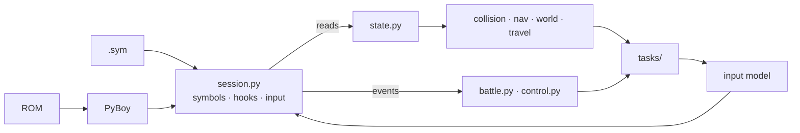

<details>
<summary><b>Advanced detail:</b> what hooks buy, precisely</summary>

Polling asks "is the menu up?" over and over and has to infer the answer from
memory that was not designed to answer it. The mobile port has to do exactly
that, and it is the source of nearly all of its subtleties: it identifies the
battle menu by `wMenuDataItems == 34` and `wMenuBorderTopCoord == 12`, because
the obvious signals are ambiguous — `wBattleMenuCursorPosition` holds the action
last *chosen*, and the pack parks the cursor in the same place the battle menu
does.

Here, `BattleMenu` firing *is* the answer. The equivalent bug class does not
exist.

What hooks cost: they only fire for routines in low ROM banks. `Session`
checks the bank of every hook at startup and raises rather than letting one
silently never fire — see [section 4](#4-hooks-the-game-asks-we-answer).

</details>

---

## 2. The shape of it

<!-- covers-api: pilot/session.py pilot/symbols.py pilot/state.py pilot/collision.py pilot/nav.py pilot/world.py pilot/travel.py pilot/control.py pilot/battle.py pilot/pilot.py pilot/gamedata.py @ 5c721b9877ce -->

Roughly 10,000 lines of Python, in layers. Arrows point from a layer to what it
depends on.

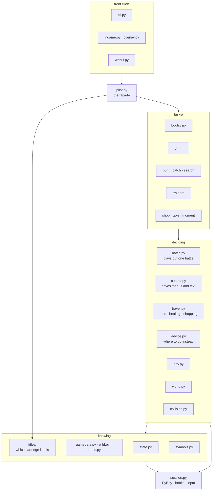

| Module | Answers |
| --- | --- |
| `session.py` | "run frames", "read memory", "what did the game just do?" |
| `symbols.py` | "where does `wPartyCount` live, and in which bank?" |
| `state.py` | "what is happening right now?", "what is in the bag?" |
| `gamedata.py`, `wild.py` | "what is this species called?", "what appears here?" |
| `items.py` | "what does a Potion cost, fix, and which pocket is it in?" |
| `titles/` | "which cartridge is this, and where does its game open?" |
| `collision.py` | "can I stand there, and how do I get there?" |
| `nav.py` | "walk to this tile", "leave by this edge" |
| `world.py` | "which map is west of here, where are its doors, its counter, its item balls?" |
| `travel.py` | "get to Cherrygrove and heal, then come back", "go and buy five balls" |
| `advice.py` | "this grind is slow — then where should I go?" |
| `control.py` | "answer this text box / pick this menu entry / use this item / is the overworld even listening?" |
| `battle.py` | "play out this battle under this policy" |
| `tasks/` | "grind to 12", "catch a Sentret", "sweep this route", "buy potions" |
| `pilot.py` | assembles all of it and exposes the tasks |

Three of those are newer than the rest and exist for one reason each.

`items.py` is the bag's half of `gamedata.py`. It answers three questions that
look like one and are not: what an item *costs*, how much HP it puts *back*, and
which status it *clears*. A Potion answers the first two and not the third; an
Antidote the first and third. Reading one table for all of it is how a poisoned
party walks past a Full Heal it is already carrying.

`advice.py` composes two things that were already known and never put together:
what a route's grass tops out at, and which maps the graph can reach from here.
Neither answers the question a slow grind raises, which is *then where should I
go*.

`titles/` holds the handful of facts that are neither in the symbol file nor in
the data files — which tile Elm's aide stands on, which ball is Cyndaquil, the
doorways out of the bedroom. They are facts about *Crystal's script* rather than
about the Gen 2 engine, and as module constants inside `bootstrap.py` nothing
could say so.

<details>
<summary><b>Advanced detail:</b> two boundaries that carry their weight</summary>

**`battle.py` takes a policy, not a decision.** `BattlePolicy` is a dataclass —
`flee_below`, `heal_below`, `use_items`, `always_flee`, `allow_evolution`,
`learn_new_moves`, `switch_to_target`, `fight_if_cornered` — and the engine plays
out one battle under it. A grind wants to win; a hunt wants to leave; a catch
wants to weaken and stop. All three use the same engine with different policies
rather than three battle loops that drift apart.

Two of those fields are not independent, and the order they are read in is the
feature: `heal_below` defaults to 0.45 and `flee_below` to 0.35, and the bag is
checked *first*. So a fight that can still be won gets a Potion and gets won,
and the flee is what answers an empty bag rather than what answers low HP. Set
the heal threshold at or below the flee threshold and it becomes dead code,
because the flee returns first — there is a test that says so, since the two
numbers look independent and are not.

**Every task returns the same shape.** `TaskResult` carries
`status` (`completed | timeout | blocked | aborted | error`), a message, a stats
dict, whether the game was saved, the backup, and free-text notes. Front ends
render that rather than each one inventing its own reporting, which is why the
CLI, the in-game menu and the web UI agree about what happened.

Note `blocked` and `timeout` are distinct statuses. "I could not get there" and
"I ran out of budget" are different problems and want different responses from
whoever asked.

</details>

---

## 3. The layers, bottom up

### `session.py` — PyBoy, hooks, and the input model

<!-- covers: pilot/session.py @ 1d2afa8f68bd -->

Owns the emulator. Runs frames, reads memory, registers the hooks, and holds the
queue of events they produce.

<details>
<summary><b>Advanced detail:</b> WRAM banking, and rendering</summary>

**`0xD000–0xDFFF` is bank-switched on CGB and Crystal really does switch it** —
banks 1, 5 and 6 all occur in normal play. Unbanked reads of that window return
another bank's bytes for a good fraction of frames, which looks like random
corruption of the party and battle state. Every access in `session.py` is
bank-qualified; `WRAM_SWITCHABLE = range(0xD000, 0xE000)` is the guard.

**Rendering is a switch, not a constant.** With a window open, drawing every
frame throttles the emulator to a few hundred fps — fine for playing, far too
slow for a task that needs hundreds of thousands of frames. `set_render(False)`
during a task is the difference between 470× real time and unusable.

</details>

### `symbols.py` — where things live

<!-- covers: pilot/symbols.py @ 27d952cbe007 -->

Parses the `.sym` file, resolves names to bank-qualified addresses, and holds the
struct offsets (`PARTY_STRUCT`, the party-mon field layout, and so on).

It also owns `HOOK_ROUTINES`, the table of what to hook — see
[section 4](#4-hooks-the-game-asks-we-answer) — and the **box shapes**, which are
how the pilot tells one menu from another.

<details>
<summary><b>Advanced detail:</b> a box is a shape, not "something is open"</summary>

The cursor keeps its previous value between boxes, so both "a window is open"
(`wWindowStackSize`) and "the cursor is somewhere" (`wMenuCursorY`) are true of
the *wrong* box. What identifies one is how many rows it has
(`wMenuDataItems`) and which screen row it starts at (`wMenuBorderTopCoord`) —
so `BOX_PACK` is `(5, 1)`, `BOX_ITEM_USE` is `(4, 3)`, and so on.

Three of them share a signature: `BOX_BATTLE_ITEM`, `BOX_SHOP_CONFIRM` and the
learn-move prompt are all two rows at row 7. That is safe only because the
contexts cannot overlap — a shop box exists only while a shop is being driven —
and it is a claim the callers have to keep rather than a property the shape
gives them.

One box is matched on half its shape. `BOX_PARTY_PICK` is `(None, 0)`, because
its row count is not a fact about the party: measured on the same
one-Pokémon party, the *field* pack's party list reports four rows and the
*battle* pack's reports two. Two menu headers for one question. Matching the
count made healing work on the map and fail in a fight, which is the half where
it matters.

`FIELD_PACK_HOLD` is here too, and it is a measurement rather than a
preference: A on the field pack's item list is swallowed at a hold of 7 frames
and lands at 8. The ordinary tap is 6. The battle pack takes 6, measured the
same way — so it is the field pack's quirk and not the pack's, and
`throw_ball` is deliberately left alone. The D-pad in that same list wants the
opposite: at a hold of 8 a DOWN press auto-repeats and the cursor arrives back
where it started.

</details>

### `state.py` — what the game is doing right now

<!-- covers: pilot/state.py @ 31084d900d4c -->

Typed reads: location, party, the battle, both readable bag pockets, the wallet,
and the game's event flags. Every read goes through a symbol, so nothing here
contains a bare address.

There is **one pocket reader**, not one per pocket: every pocket has the same
shape, a count of *kinds* followed by (item, quantity) pairs. `balls()` and
`items()` are both `pocket()` with a different argument, and `carrying(name)`
saves a caller from knowing which pocket a name lives in — the one genuinely
arbitrary fact about the bag, since nothing about "POKE_BALL" or "BERRY_JUICE"
says which one it is in.

<details>
<summary><b>Advanced detail:</b> the signal that is not what it looks like</summary>

**"World loaded" is not "party loaded".** The CONTINUE screen restores the party
and coordinates *before* the map exists, so waiting on party data starts pressing
buttons while still in the menus. `wMapStatus == MAPSTATUS_HANDLE`, with a
published map size, is the real signal.

**`wBalls` does not settle until a battle ends.** What this repo reports is
safe, because `catch.py` counts the balls it throws rather than differencing the
bag — but the one mid-battle `ball_count` guard in `_try_capture` cannot fire,
so running dry surfaces as a throw that cannot find a ball and the throw budget
is what actually ends the loop.

**Nor does `wItems` settle until the pack closes.** The same fact about the
other pocket, and measured here rather than inherited: a Potion used on the map
moved the HP immediately while `wItems` still listed it, and the count only came
down once the pack was shut. So **HP and the status byte are the evidence for a
use, and the bag is corroboration.** That distinction is not pedantry — at full
HP the game takes every press, says the item would have no effect and spends
nothing, so a press-counting caller calls that a heal.

**Only two pockets are read, and the other two are refused rather than
guessed.** A key item has no quantity byte — the addresses prove it, `wKeyItems`
is `d8bd` and `wNumBalls` is `d8d7`, twenty-six bytes later, which is
`MAX_KEY_ITEMS` plus a terminator and not twice that. Handing it to the pair
reader interleaves ids with ids and reports half the pocket as quantities of the
other half, in numbers that look right. TM/HM is a bitfield rather than a list
at all.

**The wallet is three bytes, big-endian, plain binary** — not the packed BCD Gen
1 used. `bigdt MAX_MONEY` in `engine/events/money.asm` is the tell, and
MAX_MONEY is 999,999, which needs twenty bits and so cannot be BCD in three
bytes. Decoded as BCD, ¥1,000 reads as ¥232.

**`event_done` answers "cannot tell" separately from "no".** A flag this build
does not name returns `None` rather than `False`, because the two lead to
different decisions: "already taken" skips a walk and "cannot tell" has to make
it.

</details>

### `gamedata.py`, `wild.py`, `items.py` — what the cartridge knows

<!-- covers: pilot/gamedata.py pilot/wild.py pilot/items.py @ 07c4b5889192 -->

Species names, move power and type, map names, walkability tables, event flag
indices, which wild Pokémon appear where, and everything about the bag — all
parsed out of the **pokecrystal source tree**, so they cannot drift from the ROM
being driven.

Three files because they answer three unrelated kinds of question. `gamedata.py`
is names and ids; `wild.py` is encounter tables; `items.py` is the bag.

<details>
<summary><b>Advanced detail:</b> time of day is part of the answer</summary>

`species_on(source, map, time_of_day, kinds)` takes the time because the tables
do. Route 29 trades Pidgey and Sentret for Hoothoot after dark, and a pilot
running at hundreds of times real time crosses those boundaries mid-run — so a
test that passes in the morning fails at night unless the species it looks for
is one that appears around the clock. That bit the suite once and is why the
parameter exists.

`hours(source, map)` is the other two thirds of that. Both readers above take a
*single* time of day and the pilot has only ever passed them one — the hour it
is now — so what it knew about the grass it was standing in was one third of
what the cartridge says. Reading all three blocks is what lets a picker say
*PIDGEY is here in the morning, not now* instead of dropping a species from the
offered list in silence, which is the one change to that list nobody makes and
nothing explains.

`level_range(source, map)` reads the level byte that has been sitting beside
every species since `species_on` was written and going unread. It returns
`None`, not `(0, 0)`, for a map with no table: "no wild Pokémon here" and "wild
Pokémon at level zero" are different claims, and a caller ranking places has to
be able to drop the first.

</details>

<details>
<summary><b>Advanced detail:</b> four numbers in the item tables that are not numbers</summary>

`items.py` reads four files, and each one had a trap in it.

**`MAX_STAT_VALUE` is not 999.** `heal_hp.asm` writes a full heal as that
constant rather than as an amount, and treating it as its numeric value makes a
Max Potion look *worse* than a Hyper Potion on anything under 999 max HP —
which is every Pokémon in the game. It is `FULL`, and it sorts as bigger than
any hole.

**Every mart stock list opens with its own count byte,** `db 4`. A pattern
allowing a leading digit reads that as an item called "4", and a shopping
errand's first candidate is then a name no item table has.

**Two prices are sentinels.** A Master Ball's price is 0 because no counter
sells one; the Town Map carries `$9999`, which read as a price makes it the
costliest item in the game. `for_sale` is both conditions, and `price()` reports
zero for either.

**Sleep is a counter, not a bit.** `heal_status.asm` writes the other four
statuses as `1 << PSN` and sleep as `SLP_MASK`, so a reader matching only shift
expressions leaves an Awakening curing nothing. `_statuses` matches the *names*
out of the expression rather than evaluating the arithmetic.

And one thing that is about ordering rather than parsing. `cures(status)` sorts
by how *narrow* the cure is before how cheap it is, and the order matters more
than the price does: a Miracleberry ends a poisoning and costs less than an
Antidote, so sorting on price alone spends the one item that answers all five
statuses on the one status that has four other answers — and the party is then
asleep with nothing that wakes it.

</details>

<details>
<summary><b>Advanced detail:</b> a pattern that stops matching is invisible</summary>

Every parser here shares one failure mode, and it is worth stating on its own
because nothing about it looks like a failure. A regex that stops matching does
not crash and produces no wrong value — there is simply **less of it**, and the
symptom arrives much later as an item the pilot cannot see or a map it cannot
leave.

Both of the ones found this way were found by counting, not by anything going
wrong:

**`item_attribute`'s `property` field is a flag expression.** Twenty-five key
items write it `CANT_SELECT | CANT_TOSS`, and a pattern expecting one word there
matched 232 of the file's 256 rows. Twenty-two key items were invisible — and
`state.carrying` asks this table which pocket a name lives in, so it was
silently answering "the item pocket" for every one of them.

**`warp_event`'s destination index can be `-1`.** Six warps were refused by
`(\d+)`, taking four real edges out of the Celadon and Goldenrod department
store elevators with them. A dropped edge is a place the router cannot leave.
They are kept now with `to_warp: None`, because "come out at warp 3" and "the
script decides" are different answers.

So `tests/cases/test_parsers.py` counts every parser against its own source
file, and the counts are *derived* rather than written down — a hardcoded total
needs updating whenever the disassembly moves, and would then be updated to
whatever the parser currently produces, which is not a check at all. It also
covers the two things a count cannot say: that the specific shapes which broke a
pattern still match, and that no map file with warps in it fails to fold onto a
map constant — since warps are found by that join, and a file that does not join
contributes nothing, which is indistinguishable from a map with no doors.

</details>

### `collision.py` — what you can walk on

<!-- covers: pilot/collision.py @ 662b5a3f34cd -->

Decodes the loaded map into "can I stand on this tile", and does breadth-first
pathfinding over it — so movement is planned rather than discovered by bumping
into things.

<details>
<summary><b>Advanced detail:</b> the decode, and the check that is not enough</summary>

The loaded map's blocks live in `wOverworldMapBlocks`; each tileset's
per-quadrant collision values sit in ROM at `wTilesetCollisionAddress`. Reading
both gives the collision byte for any tile.

`calibrate()` verifies its own arithmetic against `wPlayerTileCollision` — the
game publishes the collision of the tile the player is standing on, so the
decode can check itself rather than be trusted.

**That check is necessary and not sufficient**, and it is worth knowing why
before you extend this. A wrong offset can reproduce that one byte by luck, most
easily where the value is a common one. It was measured failing in the mobile
port, which uses the same technique: standing on a doorway mid-transition, the
true offset did not match and a fallback did, so the whole map decoded shifted
and a route that existed looked walled off. It fails by producing a *confident*
map rather than an error.

This repo is much less exposed, because `Pilot.calibrate()` settles and nudges
with a step first and so is rarely sampling a transition. But do not treat a
single match as proof: ask for the same offset twice, for the same player tile,
a few frames apart, and re-derive anything cached from a snapshot taken while
the map was still loading.

**Pathfinding avoids one-way ledges.** A ledge can be stood on; it is *leaving*
one in the hop direction that moves two tiles irreversibly, and a route that
used one could not be walked back.

**And it avoids people, which is a different array.** The collision map is
*terrain*: it has nothing to say about the Youngster standing in a one-tile
corridor, so a planner reading only terrain routes straight through him, bumps,
learns one tile and re-plans — once per person. `occupied()` reads the game's
object arrays instead, so the route goes round them on the first attempt.

There are two arrays and they answer differently. `wMapObjects` is what the map
*places*: sixteen entries, stable, and including things an event flag has never
spawned. `wObjectStructs` is what the game has actually *spawned*: thirteen
entries, live coordinates, and absent for anything too far away to matter.
Measured on Route 30 from the south end — eleven objects placed, exactly one
spawned, and that one is the player.

So the live array is preferred, because on the placements this is wrong in both
directions at once: a wanderer is marked where it was placed rather than where
it is, and objects nobody has spawned are marked at all. The placements are the
fallback for when the structs cannot be read — stale tiles beat no tiles,
because walking into somebody costs a refused step and the planner recovers.

Both store coordinates offset by +4, which is measured rather than assumed:
index 0 of each is the player, and on Route 30 it reads raw (11,57) with the
player standing at (7,53).

</details>

---

## 4. Hooks: the game asks, we answer

<!-- covers: pilot/symbols.py pilot/session.py @ f2cc41765658 -->

This is the spine of the whole design. Instead of polling memory to guess what
the game wants, the pilot sets a callback on the ROM routine that *is* the
question.

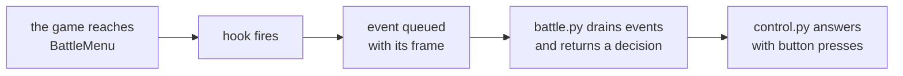

Grouped by what they are for:

| Purpose | Hooked routines |
| --- | --- |
| A decision is wanted | `BattleMenu`, `MoveSelectionScreen`, `LearnMove`, `EvolveAfterBattle`, `ForcePlayerMonChoice` |
| Text is waiting | `WaitButton`, `PromptButton`, `WaitPressAorB_BlinkCursor`, `YesNoBox` |
| A battle went badly | `HandlePlayerMonFaint`, `ForcePlayerMonChoice`, `TryToRunAwayFromBattle`, `LostBattle` |
| Saving | `SaveMenu`, `SaveTheGame_yesorno`, `_SaveGameData`, `SavedTheGame` |
| **Naming — do *not* just press A** | `NamePlayer`, `GivePoke`, `PokeBallEffect.SkipPartyMonFriendBall`, `PokeBallEffect.SkipBoxMonFriendBall` |
| A sign that something went wrong | `NamingScreen` |

<details>
<summary><b>Advanced detail:</b> the naming group, and the bank limit</summary>

**The naming hooks exist because every one of those prompts is A-confirmable,
and that is precisely the problem.** Mashing A through the intro names the
player `AAAAA` — the NAME menu defaults to NEW NAME, which opens the letter
grid, where A repeatedly spells the same letter. Mashing A through a capture
gives every Pokémon a nickname typed the same way.

Each of those hooks fires *just before* its prompt, which is the only moment
there is to decide differently. `NamingScreen` is hooked but never acted on:
reaching the letter grid at all means one of the others was answered the wrong
way, so it is a diagnostic.

**The save sequence is not the obvious one.** An overworld save goes
`SaveMenu → AskOverwriteSaveFile → SaveTheGame_yesorno → _SaveGameData →
SavedTheGame`. Two traps in that: the confirm is **not** a `YesNoBox`, so the
generic yes/no hook never sees it; and the `SaveGameData` symbol is a *different
wrapper* that a normal overworld save never reaches. Hooking the obvious-looking
name would have produced a hook that silently never fires.

**PyBoy hooks only fire for routines in low ROM banks.** Everything hooked here
is in bank `0x10` or below. `Session._register_hooks` checks the bank of each
one at startup and raises with the offending names rather than letting a future
addition quietly do nothing:

```python
if bank > S.MAX_HOOKABLE_BANK:
    high.append(f"{routine} (bank {bank:#x})")
```

**Events are drained, never cleared, inside a battle.** `drain_events()` returns
and empties; `clear_events()` throws away. Using the second mid-battle loses
anything that fired between ticks, and the thing that fires between ticks is
usually the one that mattered.

</details>

---

## 5. Battles

<!-- covers: pilot/battle.py pilot/control.py @ dcac9654c9fb -->

One engine, driven by a policy. A grind wants to win, a hunt wants to leave, a
catch wants to weaken and stop — all three are the same loop with different
`BattlePolicy` values.

### The decision pump

`next_decision()` advances the battle until it wants something, tapping through
text on the way.

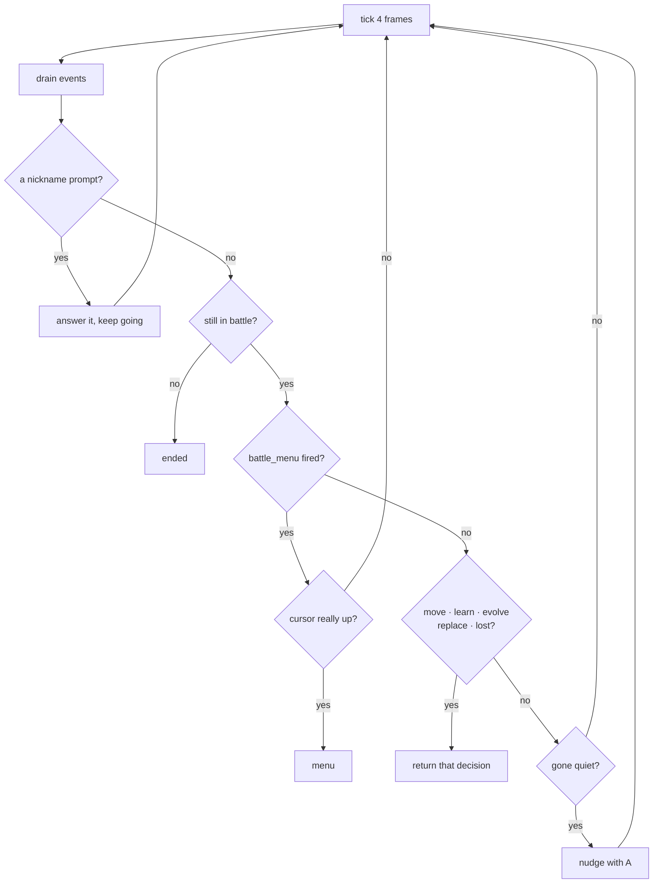

Two of those branches are the interesting ones.

<details>
<summary><b>Advanced detail:</b> order matters, twice</summary>

**The nickname check comes first, before `in_battle`.** A capture *ends the
battle with the nickname box still on screen*. Check `in_battle` before the
nickname prompt and the pump returns `ended` with the box unanswered, leaving it
for the next A tap to accept with its default of YES — and you have just
nicknamed the Pokémon you caught.

**A hook firing is not the same as a menu being ready.** `battle_menu` can fire
while battle text is still up, so the pump confirms with `_await_menu_cursor()`
before calling it a decision point. Without that confirmation, directional
presses land on text and the turn silently falls back to whatever move the
cursor was left on.

That is also the deeper reason menu navigation reads the live cursor and steps
toward the target rather than counting presses from an assumed position: **Gen 2
menus wrap**, so normalising by pressing "up" three times does nothing on a
three-item list. And those cursor variables hold the *previous* value when a
menu hook fires, which is what the settle period is for.

**The quiet nudge is a narrow fix, not a general one.** If the game asks nothing
for a while, the pump presses A — but that only happens when a textbox was
entered before we started listening. It is not a substitute for a hook.

</details>

### Fight, flee, or switch

Four answers now, not three, and the order of the questions is what makes the
bag useful rather than decorative.

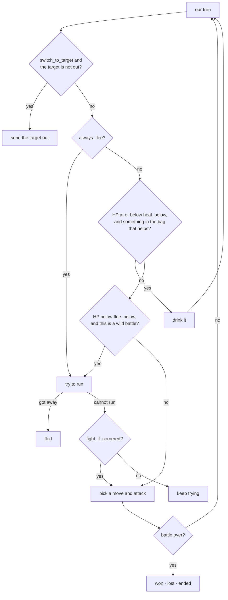

**The bag is asked before the exit, and its threshold is higher.** `heal_below`
is 0.45 against `flee_below`'s 0.35, so a fight that can still be won gets a
Potion and gets won, and the flee is what answers an *empty bag* rather than
what answers low HP. Reversed, the flee returns first and the bag is never
opened.

<details>
<summary><b>Advanced detail:</b> why `fight_if_cornered` exists, and what the bag fixed</summary>

**Trainer battles cannot be fled.** A policy that only knows how to run will
stand in one losing HP until something faints, so `fight_if_cornered` turns "I
tried to leave and could not" into "then win instead". `TryToRunAwayFromBattle`
is hooked precisely so the pilot can tell a refused escape from a successful
one, rather than inferring it from HP that has quietly gone down.

That is also where the mid-fight heal earns itself, and it cannot be seen from a
wild encounter: before it existed, "flee" in a trainer fight meant "fail to
escape, then fight it out at 20% HP" — which is how a trainer sweep with Potions
in the bag still blacked out.

Two bounds on it, both because a refused item is otherwise an infinite turn: at
most `max_heals` per battle, and an item that moves no HP stops the engine
reaching for the bag again in that fight. The count goes up either way, because
the turn is consumed either way.

**Switching exists because a grind trains one Pokémon.** The XP goes to whoever
is on the field, so `switch_to_target` sends the grind's subject out if the game
led with somebody else. `_switch_to` verifies with `active_slot` afterwards and
notes it rather than assuming the switch took.

It also *drives* the party list rather than counting presses at it, which it did
not always do. The list is `wMenuCursorY`, one row per member plus CANCEL, and
it **wraps** — so the old "press UP six times to normalise, then DOWN to the
slot" works or fails depending on the size of the party: six presses on a
two-row list return to where they started and on a four-row list land two rows
off. Measured with the cursor parked on CANCEL, where the previous turn leaves
it, the old version stayed there and pressed A twice. With a full party that
sends out the wrong Pokémon, and the only sign is a grind that trains something
else. This repo's own mutation self-check tests for the same defect in
`choose_move` by name.

**Move choice ranks by power × accuracy, not by matchup.** There is no type
chart here. Good enough to grind efficiently, and explicitly not optimal play —
listed in the README's limits for that reason.

</details>

---

## 5a. The bag

<!-- covers: pilot/control.py pilot/items.py pilot/travel.py @ 80313c297561 -->

The pilot could throw a ball and do nothing else with the pack. Using an item on
a party member is the thing everything else here depends on: healing without a
walk, curing what a Potion cannot, and drinking mid-fight.

There are **two packs**, and they are not the same pack. One opens from the
START menu; one opens from the battle menu. They ask different numbers of
questions, want different button holds, and their party lists report different
row counts for the same party.

```mermaid
flowchart TD
    subgraph field["from the map — use_item_on"]
        F1["START menu<br/>try rows until the pack appears"] --> F2["walk to the ITEM pocket"]
        F2 --> F3["walk to the item"]
        F3 --> F4["USE / GIVE / TOSS / QUIT<br/>confirm USE"]
        F4 --> F5["party list<br/>pick the member"]
        F5 --> F6["past the message,<br/>then close everything"]
    end
    subgraph batt["from a battle — use_item_in_battle"]
        B1["PACK from the battle menu"] --> B2["walk to the ITEM pocket"]
        B2 --> B3["walk to the item"]
        B3 --> B4["USE / QUIT<br/>confirm USE"]
        B4 --> B5["party list, if it appears"]
    end
```

**Nothing in either chain trusts a press.** Every box is confirmed by its shape
before anything is pressed into it, the pocket and the item are walked to by
*reading* `wCurPocket` and `wCurItem`, and the outcome is judged by HP and the
status byte rather than by the presses landing.

<details>
<summary><b>Advanced detail:</b> five measurements, each of which made this report success while doing nothing</summary>

**START is ignored while a map script is running.** So is everything reached
through it, and the failure names the wrong thing: `open_pack` reported "could
not open the pack" for a pack that was fine, and `save_in_game` made three
identical attempts and reported "did not commit". Measured on the
`grass_cyndaquil` fixture, which sits with `wScriptMode` at 1 — four
consecutive START presses do nothing at all, and then `menu_row_count` walks the
player through grass looking for rows that are not there.

`Control.settle_for_menu` runs the script out first and names the one case it
cannot fix (a battle). The knowledge was already written down, in
`Pilot.settle_for_save`, and wired to exactly one set of callers: the three
front ends ask before *offering* a save, and neither of the two places that
press START themselves did.

**The pack's START row is not fixed.** The START menu grows as the game
progresses — no POKéDEX or POKéGEAR early on — so PACK sits at a different
index depending on how far things have got. `open_pack` drives to a row, presses
A, and asks whether the pack's own box appeared. `backup.py` learned the same
thing about SAVE and solved it there by knowing SAVE is always third from the
end; PACK has no such anchor.

**A on the field pack's item list needs a longer hold.** Swallowed at 7 frames,
lands at 8, measured one frame at a time. The ordinary tap is 6, so the first
version drove the pack, reached the right item, and reported "the USE box never
appeared" from a pack that was open and correct. The battle pack takes 6.

**A box on screen is not yet a box that takes input.** `await_box` returning on
the first matching frame made every press "land", every box "appear", and the
Potion never get used. The field pack's party list takes input after ten frames
and the battle pack's after thirty, so the settle is thirty. `backup.py` already
carried this warning about the save confirm — "any A pressed before that is
swallowed" — and it is the same fact about other boxes.

**DOWN past the last pack entry lands on CANCEL and stays there.** The list does
not wrap, so an overshoot is walked back once and a second miss is reported
rather than pressed through.

**`past_the_message` must stop at a box, not at a flag.** Not `advance_text`,
which taps A for as long as the game keeps asking — and after a heal the pack is
still open and still asking. With two Potions in the bag that press lands on the
next item and uses it.

And the standard for all of it: **at full HP the game takes every press, says
the item would have no effect, spends nothing, and drops back to the pack.** A
press-counting caller calls that a heal. So `travel.py` reads the HP and the
status byte, and re-reads the mon after a cure rather than counting one that the
game refused.

</details>

<details>
<summary><b>Advanced detail:</b> which item, out of the ones actually carried</summary>

`heal_from_bag` spends the **least wasteful** item that finishes the job: the
smallest whose amount covers what is missing, falling back to the largest held
when nothing covers it. Sorting by price is how a Full Restore gets spent on
four missing HP; sorting by size is how it gets spent on twenty.

`cure_from_bag` runs *first*, and skips fainted members — nothing in the item
pocket revives one, so offering a cure there is a press that cannot work. A
Revive is `ITEMMENU_PARTY` too, which is why the filter is on the Pokémon and
not only on the item.

Battle-usable and field-usable are different lists, asked for by name rather
than assumed to be the same: a Berry heals HP in a fight and is
`ITEMMENU_NOUSE` outside one, so offering it on the map is offering a press that
silently does nothing.

Both of those questions are answered out of `items.attributes`, which is why a
row missing from that table is not a cosmetic problem: an item with no row is an
item that is never offered, and `state.carrying` answers "which pocket?" from
the same place. That table dropped twenty-four rows for a while — see *a pattern
that stops matching is invisible*, above.

</details>

---

## 6. Moving around

<!-- covers: pilot/nav.py pilot/world.py pilot/travel.py @ fb2726cdd6dc -->

Five layers, each built on the one below. The top one is a fan rather than a
single answer, because "go somewhere and do a thing" is three different things.

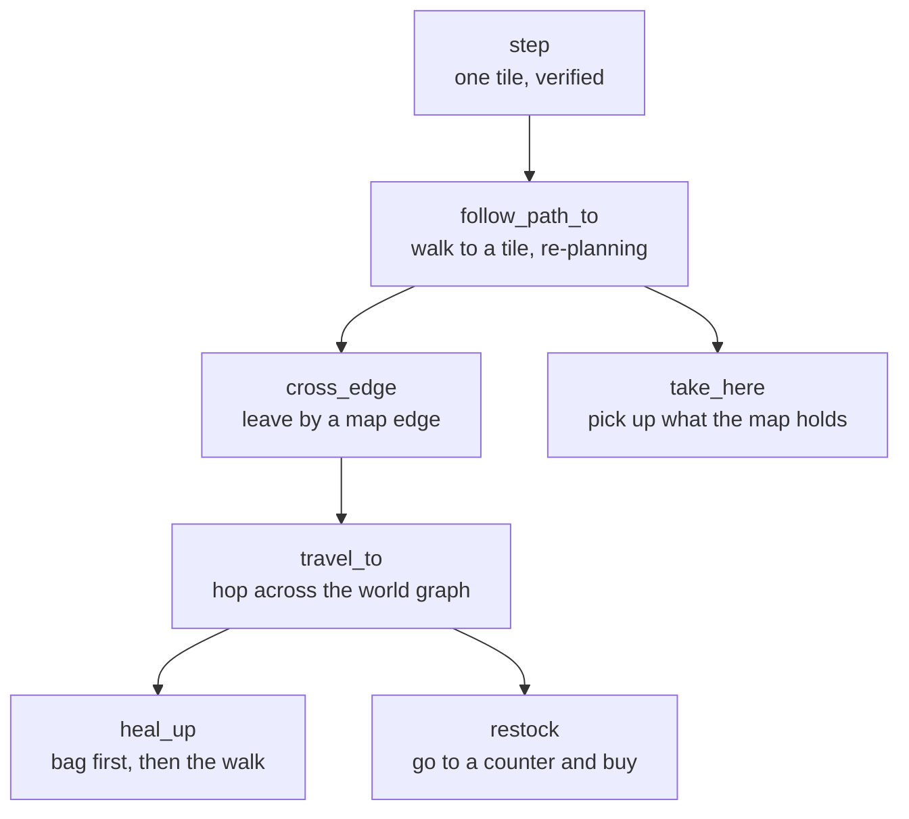

A step is not "press the button for N frames". Fixed-length presses go wrong in
both directions: too short and the press is spent turning, too long and you take
a second step into grass you did not plan for.

<details>
<summary><b>Advanced detail:</b> what a re-plan budget is a budget for</summary>

`follow_path_to` has two bounds, and they count different things.
`max_battles` bounds wild encounters; `replans` bounds *being wrong about the
map* — a tile the collision decode thinks is open and an NPC is standing on.

It also keeps two kinds of knowledge about non-wall tiles apart, because they
age differently and are given up in a different order. `bumped` is what refused
a step: measured, and it accumulates. `occupied` is who is standing where right
now, re-read on **every** plan rather than accumulated, because a wanderer
moves — the tile it blocked ten steps ago is open and the one it is on now is
not.

When no plan can be made at all, the people are given up first and the measured
tiles second. **An avoid set can seal a corridor**, and the object read is the
half most likely to be wrong about one: a route whose only way north is a
single tile is impassable for as long as somebody stands in it, and refusing to
plan is worse than walking up and taking a refused step. Giving up the measured
tiles happens once only — a second time just walks into the same obstacle
forever.

They were one bound for a while, against a comment saying they were not. A
battle inside the step loop broke out and the top of the loop charged it a
re-plan like any other derailment, so the budget was really "eight
interruptions of any kind" — and crossing a route spends that on encounters
before arriving anywhere. Measured: Route 30's item ball, thirty-five tiles of
grass away, reported `blocked` with the collision map perfectly happy about the
path. Only an obstacle is charged now, which is what makes eight enough.

</details>

<details>
<summary><b>Advanced detail:</b> edge tiles, and the exploratory fallback</summary>

**A connection spans only part of a shared edge**, so `cross_edge` walks to
walkable edge tiles **centre-out** and tries to step off each one. With a
collision map it plans the route to each candidate, which matters because routes
are full of one-way ledges — an exploratory walker can drop down one and strand
itself in a region with no way back up.

**There is a fallback for when the decode is not trusted.** `cross_edge` checks
`self.collision.calibrated` and drops to `_cross_edge_explore` if not, rather
than pathfinding against a map it does not believe. Note that flag is from the
*last* calibrate call, not a fresh one — see the caution in
[`collision.py`](#collisionpy--what-you-can-walk-on).

**The world graph is parsed from the disassembly, not the ROM.** `map_attributes`
gives edge connections; `warp_events` in each `maps/<Name>.asm` gives the doors.
Together they answer "how do I get from this route to the nearest Pokémon
Center", which is what makes unattended healing possible. The mobile port reads
the same relationships out of the cartridge instead, because a phone has the ROM
and the `.sym` and no source tree.

**Healing is a round trip on purpose.** `heal_round_trip` goes, talks to the
nurse, and comes back to where it was working. Ending the trip at the Pokémon
Center would leave a grind standing in a town with no grass in it — which is
exactly the bug the mobile port shipped and had to fix.

**But the bag comes first.** `heal_up` is the entry point, and its order is the
feature: cures, then HP, then the walk. Cures before HP because a Potion does
not fix poison, so healing the HP first and *then* asking whether the party
needs healing sees a full-HP party, calls it done, and leaves the poison ticking
on the next patch of grass. The bag before the walk because a Potion is instant
and the nearest Center from Route 30 is two maps and a gate building away,
through grass, fleeing an encounter every few tiles. `healed_via` records which
one it was, because a row reading "healed" cannot tell a two-second bag heal
from a two-minute round trip.

**A clerk is not a nurse.** A nurse stands behind a desk you approach from
below; a Mart clerk stands behind a one-tile counter you talk *across*, and the
tile between is a wall. Measured in Cherrygrove: the clerk is at (1,3), (2,3) is
the counter, and the player has to be at (3,3) facing left. The tile below the
clerk is not walkable at all, so the nurse's approach reaches nothing and
reports no counter. `talk_to_clerk` tries every tile that could see the clerk —
the four adjacent and the four two away along an axis — nearest first.

**The world graph reads three more things off each map.** The counters and their
clerks, so `restock` has somewhere to go; the item balls, joined to the
`itemball ANTIDOTE` line in the script each one names, which is the only place
the item appears; and the fruit trees, found by sprite because a tree is
`OBJECTTYPE_SCRIPT` like any NPC. An item ball also carries the **event flag**
that hides it once taken, which is what lets `things_here` answer before the
walk — the mobile port has to go and press A to find out.

**`routes_from` answers many destinations from one search.** `route_to` is
predicate-first-match, which is the right shape for "the nearest Pokémon Center"
and the wrong shape for ranking a list: asking it about twenty-two counters is
twenty-two walks over the same graph.

</details>

---

<details>
<summary><b>Advanced detail:</b> the fallbacks, and why they were the least
tested code here</summary>

`walk_to`, `cross_edge` and `find_grass` each have two implementations: a
planned one over a calibrated collision map, and a fallback that feels its way
by bumping into things. The fallbacks run when the collision decode is missing
or a route could not be planned — which is to say, when something has already
gone wrong.

They were the least-covered lines in the project: `_cross_edge_explore` had 32
of its 35 lines never executed, `_find_grass_sweep` 23 of 26, `_walk_to_greedy`
26 of 38. The code that handles trouble was the code least likely to work.

They need no ROM, which is the part that had been missed. They navigate by
bumping, so what they need is something to bump into — `tests/fake.py`'s
`FakeWorld` is a small walkable grid wired into a session's work RAM, with walls
that block, grass that reads as an encounter tile, and edges that hand you to
another map. The player moves one tile per press, which is what `step` is
written against.

**`_walk_to_greedy` cannot route around a wall on a straight approach**, and
that is now pinned by a test rather than left to be discovered. It only ever
tries the two axes that reduce the error, so with the goal directly left and a
wall directly left there is no perpendicular to fall back on: it bumps three
times and gives up. That is what it promises — "enough for the short,
mostly-open hops the pilot needs" — but "sidestepping obstacles" in the
docstring reads like more than it is.

`step` reaches through the session to `pyboy.button_press` rather than going
through `tap`, because a step is a press held until the player has moved, not a
tap of fixed length. That is why a fake that stops at `tap` cannot drive any
movement code, and it caught out the first version of these tests: an assertion
counting `session.presses` was measuring a list that movement never touches.

</details>

## 7. The tasks

<!-- covers: pilot/tasks/base.py pilot/tasks/grind.py pilot/tasks/hunt.py pilot/tasks/catch.py pilot/tasks/search.py pilot/tasks/bootstrap.py pilot/tasks/trainers.py pilot/tasks/shop.py pilot/tasks/take.py @ 1dee4165d242 -->

Every task returns a `TaskResult`: a status, a message, a stats dict, whether the
game was saved, and notes. Front ends render that shape rather than inventing
their own.

| Task | Does |
| --- | --- |
| `bootstrap` | plays a brand-new game up to where grinding is possible |
| `grind` | trains one Pokémon to a target level on the current route |
| `hunt` | searches the route for a species and hands you the battle |
| `catch` | the same search, then weakens and throws |
| `trainers` | sweeps every trainer on a route |
| `shop` | walks to the nearest counter stocking something and buys it |
| `take` | picks up the item balls and fruit trees on this map |
| `search` | the wild-encounter loop `hunt` and `catch` share |

Two of those are **idempotent errands**, and reporting them that way matters.
Running `shop` when the bag is already full, or `take` on a map with nothing
left, is `completed` with nothing bought or taken — it is the state the errand
exists to reach, and the second run is not a failure. `take` draws one further
line: reaching something that turns out to be empty is fine (a fruit tree gives
fruit once a day and is offered every time), while being unable to *reach*
something is the pilot's problem and is reported as blocked.

### Five that act on where you already are

<!-- covers: pilot/tasks/moment.py pilot/tasks/shop.py pilot/tasks/take.py @ 7b886dd2cd2c -->

Every searching task above goes *looking* for something. These do the obvious
thing with the situation in front of you and take no target:

| Command | Does | Refuses when |
| --- | --- | --- |
| `battle` | plays out the battle you are in, wild or trainer | you are not in one |
| `capture` | weakens and throws at the wild Pokémon you are facing | not in a battle · it is a trainer's · party full · no balls |
| `heal` | cures and heals from the bag, then walks if it must | you are in a battle · no party |
| `take` | picks up what this map is still holding | you are in a battle |
| `shop` | buys more of what has run out | you are in a battle · nothing sold anywhere stocks it |

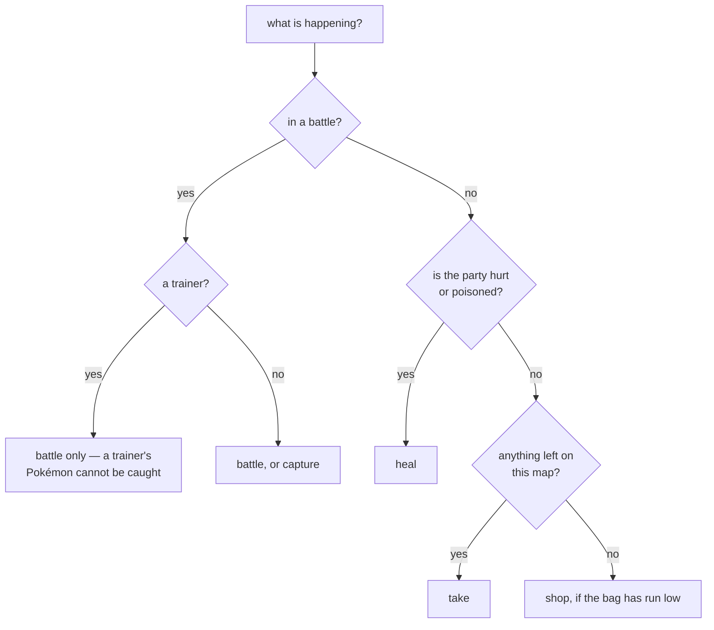

None of them contain new game logic: the battle engine, the capture loop and the
Pokémon Center round trip already existed and are used exactly as the searching
tasks use them.

<details>
<summary><b>Advanced detail:</b> the one thing that had to be detected, not assumed</summary>

**`capture` subclasses `CatchTask`** rather than copying it. `_try_capture`,
`_pick_ball`, `_chip` and `_watch_throw` are the parts that matter and they are
identical; the only difference is that nothing is searched for first.

**`battle` has to work out whether the menu is already up.** `BattleEngine.run`
takes `menu_open`, and getting it wrong is quiet rather than loud. Invoked by
hand you are usually sitting at the battle menu, so its hook has *already*
fired — telling the engine to wait for one means waiting for an event that will
not come again. Measured on the same fixture:

| `menu_open` | reported |
| --- | --- |
| `False` | won in **0 turns** — resolved by the engine's quiet nudge, not by play |
| `True` | won in **1 turn** — the turn it actually took |

But it is not always up: run this while *"Wild HOPPIP appeared!"* is still on
screen and there is no menu yet. So the task calls the same cursor check the
engine uses internally and passes the answer, which is right in both cases.

**`flee_below` defaults to 0 here**, not the engine's 0.35. You asked for this
battle to be played out; bailing on low HP would be answering a different
question. Pass `--flee-below` to get the escaping policy.

**Weakening is guarded**, so `--weaken-to` will not knock out the thing you asked for once it has learned what one swing does — see
[Catching](#catching) for the guard itself. `capture` starts that
memory cold, which is why it does not weaken unless asked.

**`heal` reports an already-healthy party as completed**, not as an error —
nothing needed doing, which is the outcome the caller wanted. `--force` skips
the bag and goes anyway, which is also how the round trip gets exercised:
verified travelling `ROUTE_29 → CHERRYGROVE_POKECENTER_1F (2 hops)` and back.
That took 0.1s of wall time, which looks impossible until you remember this runs
at roughly 28,000 fps headless — about 47 seconds of game time.

"Healthy" includes the status byte, and it did not always. `heal` filtered the
party on `hp < max_hp` alone, so a party at full HP and *poisoned* reported "the
party is already at full health" and did nothing — which is the exact state a
grind leaves behind, and the one a cure exists for.

**`shop`'s default is the question rather than an item.** With no argument it
buys balls when the bag has none and potions otherwise, because that is the
thing that has run out. It also checks the wallet *before* the walk: four maps
to discover you cannot afford one Potion is the same amount of walking as
affording it, and a worse answer. What it cannot check in advance is what a
counter will actually sell — Cherrygrove keeps Poké Balls behind the Mystery Egg
flag, so its listed stock and its real stock differ for the whole early game.
`buy_from_clerk` returns *why* it refused rather than a bare false, and the
errand answers with a place name: "not stocking it today; AZALEA_MART also lists
it".

**`take` presses A and reports the bag, because that is the only evidence.** An
item ball gives an item and moves nothing else. What it *can* do in advance is
skip a ball already taken, using the event flag from the object's own
`object_event` line — which is the one place this repo can answer a question the
mobile port has to walk over and press A to settle.

</details>

### What every task shares

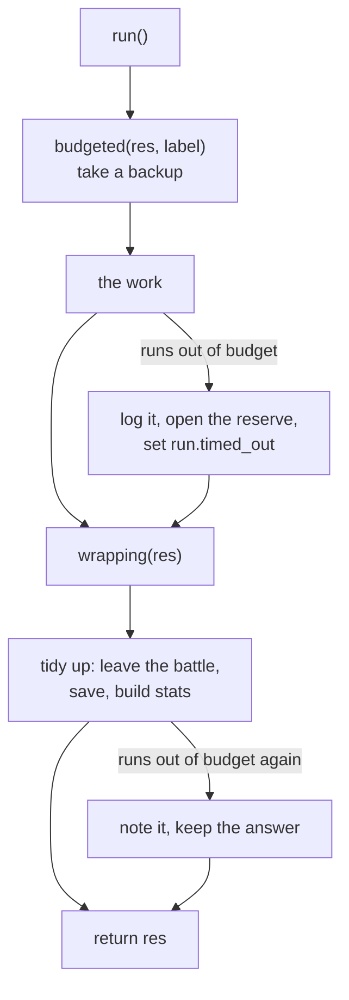

Four tasks each took a backup, caught `PilotTimeout` around the work, logged it,
opened the budget reserve, and then wrapped the *wrap-up* in a second guard —
because tidying up drives the emulator too and can itself run out of frames.
`TaskLifecycle` in `tasks/base.py` holds those three pieces; each task keeps its
own body and its own idea of what "done" means.

<details>
<summary><b>Advanced detail:</b> the two bugs a rule in four places had</summary>

**`hunt` had no guard on its wrap-up.** Three of the four did. So a timeout
while hunt put the battle away escaped `run()` entirely: the caller got an
exception where every other task returns a `TaskResult`, and the CLI printed a
traceback. That is what a rule kept in four places does — it is right three
times and nobody notices the fourth.

**And where the `return` sits turns out to matter more than it looks.** The
wrap-up guard swallows a timeout so a finished job is not lost to a slow tidy-up.
A `return res` *inside* that block means swallowing falls off the end of the
function and hands the caller `None` — worse than the exception it replaced,
because `None` has no status to read. Every `run()` returns at method level, and
a test asserts it by walking the AST rather than trusting a reading.

**`run.timed_out` replaces a local flag** each task kept by hand. Renaming it
found the last straggler: three call sites were `if timed_out:`, and grind also
had `elif timed_out and on_timeout == "revert":`, which a narrower search
missed.

</details>

### Catching

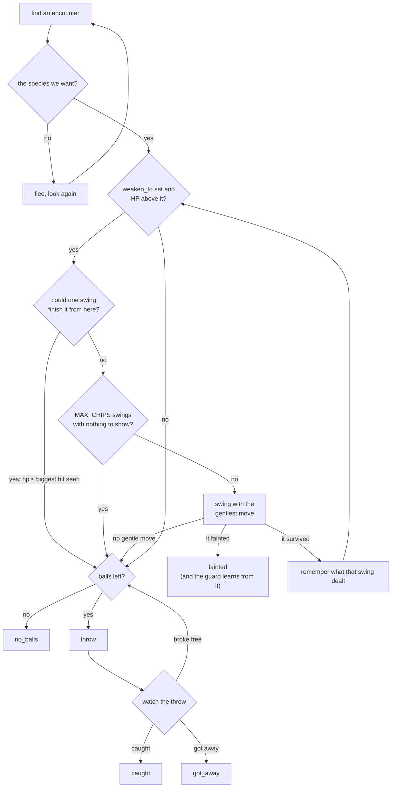

**Weakening is guarded by what it has already done.** A ball's odds turn on how
much HP is left, so weakening first is worth real balls — but a knockout loses
the target outright, and the HP threshold is not a safe stopping point on its
own. Against something small, one swing carries it from above the line straight
to zero.

`Damage` is the guard: the biggest hit one swing has been seen to land. Nothing
reads the damage formula, so that measurement is the only evidence available,
and the rule is just *never swing at something with no more HP than this*. A
knockout is a measurement too, and the most useful one — if the target had 11 HP
and one swing took all of it, a swing does at least 11. That is why a hunt keeps
one guard across every encounter rather than one per battle: the first target is
the swing that cannot be guarded, and losing it protects all the rest. `capture`
acts on a single battle and therefore starts cold, which is why it does not
weaken unless asked.

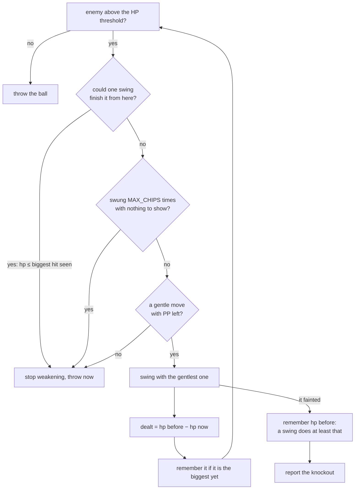

<details><summary><b>Advanced detail:</b> the power byte lies about eleven moves,
and they are exactly the ones you must not pick</summary>

Ranking by the move table's power byte to find something gentle has a trap in
it. Gen 2 stores the fixed-damage and one-hit-KO effects with a power of 0 or 1,
because their damage is computed rather than scaled — so sorting ascending puts
every one of them *ahead* of TACKLE. Asked for the weakest damaging move, the
obvious implementation returns GUILLOTINE:

| move | power | what it actually does |
| --- | --- | --- |
| GUILLOTINE | 0 | the whole bar |
| HORN&nbsp;DRILL, FISSURE | 1 | the whole bar |
| SUPER&nbsp;FANG | 1 | half of current HP |
| SEISMIC&nbsp;TOSS, NIGHT&nbsp;SHADE | 1 | your level, in HP |
| PSYWAVE | 1 | up to 1.5× your level |
| COUNTER, MIRROR&nbsp;COAT | 1 | twice what you just took |
| TACKLE | 35 | 35 power, scaled normally |

`UNGENTLE_EFFECTS` excludes them by effect rather than trying to rank them,
because there is no gentle version of a one-hit KO. The learned-damage guard
cannot substitute for this: it learns from the swing it just took, so a first
swing of GUILLOTINE teaches it the maximum and costs the target to do it.

Status moves are excluded too, by the `power > 0` test, for the opposite reason
— ranked by power they are the gentlest thing available and they weaken nothing,
so weakening would spend every turn until `MAX_CHIPS` achieving exactly nothing.

</details>

<details>
<summary><b>Advanced detail:</b> the weakest move, and the pump</summary>

**`--weaken-to F` picks the gentlest move available**, because the usual way to
lose a catch is to knock it out. `_chip` filters to moves that take HP off
without deciding the battle by themselves and takes the lowest-powered of those;
with none it returns `nomove` and the caller throws anyway, because a worse
throw still beats no throw. It reports what happened rather than pass/fail —
`ok | fainted | ended | nomove | stuck` — since a knockout is a measurement the
guard wants and "nothing to swing with" is not a failure at all.

**A knockout ends the battle, so `_chip` reports it as `ended`** rather than as
a zero it could read — the enemy struct is cleared before anyone gets the
chance. The caller tells a knockout from a defeat by asking whether *our* lead
is still standing, which the party still answers after the battle is over.
Getting this wrong is not loud: a live hunt reported twelve encounters, zero
balls thrown and seven Pokémon "got away", when it had in fact killed all seven
— and the guard learned nothing from any of them, so it did it again every time.

**`_watch_throw` delegates to the battle engine's pump rather than tapping A
blindly.** A stray A while the battle menu is up selects FIGHT, which leaves the
pack out of step and quietly burns a ball on the next throw.

**A knockout during weakening can be followed by learn/evolve prompts**, which
is why `_watch_throw` lets the engine settle the post-battle state and then
re-reads the situation instead of assuming the battle simply ended.

**With no balls it refuses up front** rather than hunting first and failing at
the throw — `_pick_ball` raises `LookupError` before the search starts. And a
Master Ball is never thrown unless you name it.

</details>

---

## 7b. Where to go instead

<!-- covers: pilot/advice.py pilot/wild.py @ 2cb3e6dd30ec -->

A grind that runs its budget and gains two levels has answered the wrong
question. `advice.py` answers the right one, out of two facts that were already
known and never put together: what a route's grass tops out at, and which maps
the graph can reach from here.

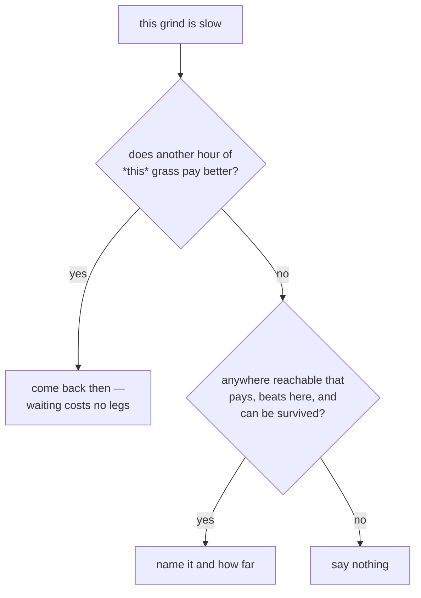

Waiting is offered ahead of walking because an hour costs no route and no legs.
Silence is a real answer, and the common one in the mid-game — it has to read as
silence rather than as a recommendation to stay put.

<details>
<summary><b>Advanced detail:</b> three conditions, two of which are bugs it had first</summary>

**It has to pay** — the grass tops out at or above the level being trained. One
fact about two numbers, and deliberately not a model of experience.

**It has to beat here.** A Lv2 on Route 29 was being sent to Route 46, which
gives exactly the same Lv2-3. That is a wasted journey dressed as advice.

**It has to be survivable.** This is the one worth writing down: "tops out at or
above the lead" alone sent a Lv5 on Route 29 two maps to Route 27 — which the
graph really does reach, through New Bark — and Route 27 gives Lv28-32. The
advice was to walk a Lv5 Chikorita somewhere the first thing it met would knock
it out. A route that *pays* is not the same as a route that can be *survived*,
so a candidate's lowest encounter may be at most `OVER_LEVEL` above the lead.

With all three, a Lv5 on Route 29 is told *Route 31 gives Lv4-5, 3 maps away*,
and a Lv30 is told Route 27 — which is the proof the rule is about the gap
rather than about that route.

`better_hour` needed the same "beat here" correction, and it was found by
measuring rather than reasoning: Crystal's three blocks carry the *same* levels
on every Johto route, so the first version advised coming back in the morning
while standing in an indistinguishable afternoon. Measured again afterwards:
null at every level on every Crystal route, which is the honest thing to say
about that half of the feature — and a hack that changes the tables gets it for
free.

</details>

---

## 7c. One engine, many titles

<!-- covers: pilot/titles/contract.py pilot/titles/crystal.py pilot/titles/generic.py pilot/titles/pick.py pilot/tasks/bootstrap.py @ 00c5b7fb80c0 -->

Everything the pilot does is resolved by name from the symbol file or parsed out
of the disassembly — except a handful of tiles, and those all belong to the
opening. Which tile Elm's aide stands on, which of three balls is Cyndaquil, the
doorways between a bedroom and Route 29.

Those were module constants inside `tasks/bootstrap.py`, where nothing could say
they were *Crystal's* facts rather than Gen 2's. A hack that moved the lab got a
pilot pressing A at a wall for four hundred taps and then a report blaming the
ROM.

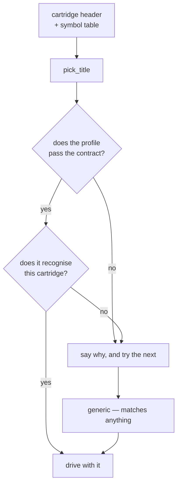

`generic` is last and matches anything, so an undescribed cartridge is supported
*immediately*: grinding, hunting, catching, healing, shopping, taking and the
trainer sweep all run off the symbol table and the map files and need no profile
at all. What it cannot do is start a new game, and it says so by name before
pressing anything rather than failing halfway through an intro.

<details>
<summary><b>Advanced detail:</b> the contract earned itself on its first run</summary>

The failures a hand-written profile has are all quiet ones — a coordinate given
as a list instead of a pair, a map named by id where the code wants a constant,
a `starters` entry missing its species. None is a crash at load, which is
exactly why they need finding at load. So `validate_title` checks the *shape* of
every field, and `pick_title` skips a profile that fails: a hack with a broken
description keeps a working pilot rather than half-driving with one it cannot
trust.

It is deliberately not exhaustive about *values*. Whether Elm's lab really is at
(5,2) is not something a checker can know, and a profile that says the wrong
tile is a profile that talks to a wall.

**And it rejected the profile written alongside it.** `first_route.edge` said
`"west"` while the contract wanted `"left"`, because a push is a *button* and an
edge is a *compass bearing* and there was one list for both. Header matched,
symbol matched, profile silently discarded, pilot quietly running as `generic`.
That is precisely the class of failure the file exists for, arriving before
anything shipped rather than after.

**Recognition is header *and* symbol.** A pokecrystal hack routinely keeps
PM_CRYSTAL in its header, so matching on that alone claims every hack as Crystal
and then walks into a moved lab. Crystal asks for a symbol only the Johto tables
define. What this cannot do is tell two hacks of the same base apart when
neither changed its header nor its symbols; `--title` is the honest answer
there, and it goes through the same validation — naming a profile by hand is the
one path a profile author would use to try their own file, so skipping the check
there would be the worst place to skip it.

The header is NUL-terminated in practice: reading all sixteen bytes of
0x0134-0x0143 gives `"PM_CRYSTALBYTE"`, the title followed by a manufacturer
code, and no profile matches.

</details>

---

## 8. Three ways to drive it

`cli.py` is a dispatch table, not a staircase. `main()` parses, checks the ROM
exists, and looks the command up:

| group | what it gets | commands |
| --- | --- | --- |
| `STANDALONE` | just `args`; owns its own session | play, serve, timeline, resume, slots/save/load/undo, backups |
| `IN_GAME` | `(pilot, args)` with the save already loaded | status, hunt, battle, capture, heal, catch, trainers, grind, take, shop |
| neither | a pilot and deliberately *no* loaded game | bootstrap |

It was one 342-line function six deep in `if args.cmd ==`, at 35% coverage in a
codebase whose median function is eight lines — so nothing about a command's
argument wiring could be exercised without running the whole CLI, and a typo in
`args.foo` surfaced when somebody used it. `main()` is 33 lines now and each
command is its own function.

The test worth having is the dullest: that the table and the parser agree. A
command added to one and not the other is invisible until you type it.

`pilot/web/index.html` is checked too, which it was not: every element the
script looks up must exist in the markup, every `api/…` the page calls must be
one `webui.py` serves, tags and CSS braces must balance, and the palette must
meet contrast at the bar for what each colour actually is. The endpoint check is
the one that earns its place — a renamed route leaves the button on screen, the
fetch 404s, and the only sign is in a console nobody has open on a phone.

Two more checks of the same kind, and the same failure: **a control that looks
fine and does nothing.** Every task *kind* the page can send must be one
`_plan` knows how to plan, since the fall-through there is a polite refusal and
the only sign is a button that appears broken. And every `state.foo` the page
reads must be a field the server publishes, since a renamed payload field
renders as "undefined" on a phone with no console open.

<!-- covers: pilot/cli.py pilot/ingame.py pilot/overlay.py pilot/webui.py pilot/interactive.py @ 97ab0fc9edc2 -->

The same tasks, three front ends, one `TaskResult` shape between them.

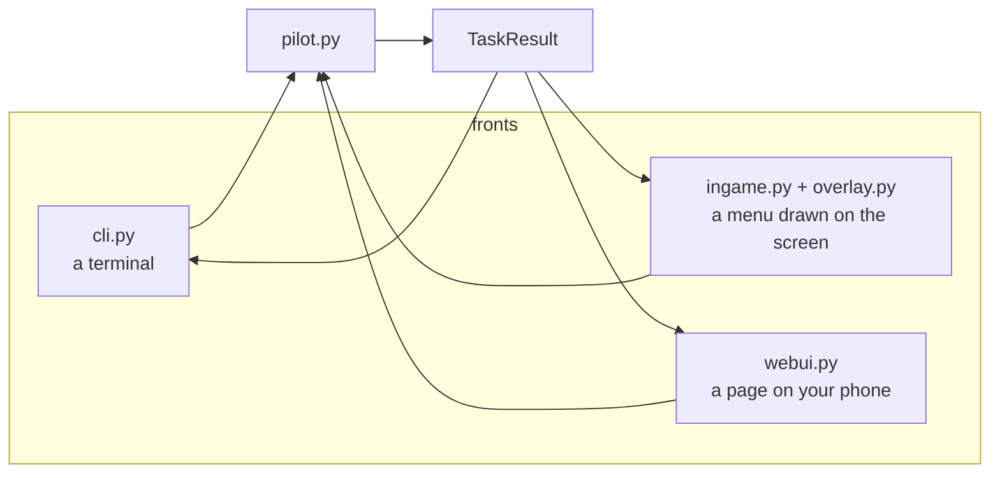

<details>
<summary><b>Advanced detail:</b> the web UI's two rules</summary>

**It binds to the LAN behind a per-run token, and must not be port-forwarded.**
It drives an emulator on your machine; there is no authentication model beyond
the token, and it is not built to face the internet.

**The idle loop runs the game at normal speed, not as fast as it can.** Left
uncapped it ran at 127× real time while nobody was doing anything, which is both
useless and hot. `set_emulation_speed(1)` while idle, `0` — uncapped — only
inside a task.

A malformed request also used to kill the pilot: `{"frames": "fast"}` raised a
`ValueError` past the loop and into a `finally: self.stop()`, *after* the handler
had already replied `{"ok": true}`. Both the handler and the planner validate
now.

</details>

---

## 8a. Slots, and undoing a job

Three slots you pick, plus one the pilot writes for itself before every job.

```bash
crystal-pilot slots              # what is kept
crystal-pilot save --slot 2      # this exact moment
crystal-pilot load --slot 2      # back to it
crystal-pilot undo               # back to just before the last job
```

A slot holds a **machine save state** and the `.sav` beside it. PyBoy can put a
state back, so a slot here is an exact frame: it can be taken mid-battle, and
loading it returns you to that instant.

**This differs from the mobile port on purpose, and the difference is the
emulator's.** WasmBoy will capture a state and will not restore one — its
`loadState` rejects even its own saved states — so mobile slots hold battery
saves, which makes them save *points*: they cannot be taken in a battle, and
loading one puts you at the title screen's CONTINUE. Same word, weaker promise.
If you use both, that is the thing to know.

<details>
<summary><b>Advanced detail:</b> why the undo point lives in the facade</summary>

**Every job marks an undo point, and it is marked in one place.** `Pilot.grind`,
`hunt`, `catch`, `trainers`, `battle`, `capture` and `heal` all call
`mark_undo()` first. It could have gone in each task — four of the seven already
took a `backups.take` of their own and three did not, which is exactly the
drift a rule kept in seven places suffers. "Every job is undoable" is a promise
about the whole surface, so it is kept at the surface.

**The undo slot is not the same thing as a backup**, though both snapshot before
a task. A backup is insurance against losing a game and is kept for forty sets;
the undo slot is one step backwards, overwritten by the next job without
ceremony. Keeping them separate means clearing your undo point cannot cost you
a backup, and pruning backups cannot cost you your undo.

**`mark_undo` never fails a job.** If snapshotting raises, it says so and the
job proceeds. Bookkeeping that can refuse the thing you actually asked for is
worse than bookkeeping that occasionally is not there.

**A slot writes the `.sav` as well as the state**, and `load` writes it back
out. Otherwise the battery on disk would still describe the game you left, and
the next in-game save would be layered onto a different game's save file.

</details>

## 9. Recording, checkpoints and backups

<!-- covers: pilot/recorder.py pilot/timeline.py pilot/backup.py @ 483e1acd272d -->

Three different things, easily confused.

| | What it is | What it is for |
| --- | --- | --- |
| `recorder.py` | a sped-up video | *looking* at what the pilot did |
| `timeline.py` | periodic save states | *resuming* from any point in that run |
| `backup.py` | copies of the `.sav` and a save state | *not losing your game* |

The video is a timelapse, not a replay: a grind is hundreds of thousands of
emulated frames, so frames are sampled. The checkpoints are the frame-exact part
— the video is for looking, the save states are for resuming, and
`timeline`/`resume` tie the two together.

<details>
<summary><b>Advanced detail:</b> why two kinds of backup</summary>

They protect against different failures. The `.sav` is the battery save — what
the game itself wrote, and what you would lose to a bad in-game save. A save
state is the whole machine, including things the `.sav` does not carry, and it
is what you want if a task leaves the game somewhere strange.

**Restoring copies the `.sav` last, after flushing SRAM.** This ordering is not
cosmetic. Loading the save state brings that moment's SRAM with it, so anything
that flushes SRAM *after* the `.sav` has been copied writes the state's bytes
over the ones just restored. The `.sav` on disk and the running machine are
routinely out of step — SRAM only changes when the game commits a save — so the
two are genuinely different bytes. Before this was fixed, a restore reported
success, logged the `.sav` it had used, and left a file that had never existed
in that backup: same party, same map, different bytes. Found by restoring a real
save and comparing hashes, which is the only way it shows.

**Pruning drops whole sets, ordered by the timestamp in the name.** Not by
mtime: `take` copies the `.sav` with `copy2`, which preserves the *source*
save's modification time, so every `.sav` backup inherits whenever the live save
was last written rather than when the backup was made. Pruning the two suffixes
independently by mtime deleted the `.sav` half of recent sets while keeping
`.sav`s from much older ones — and a half-pruned set is worse than no backup,
because the surviving `.state` makes the restore look available while the bytes
it would have used are gone.

**Pruning only touches files `take` named.** The backup directory is shared, not
private: `hunt --keep-battle` parks a `found-<SPECIES>.state` there so `play` or
`resume` can pick the battle up. It has no `.sav` by design, which makes it look
exactly like the half-written set that prune-by-set exists to clear away — so
the sweep is restricted to names matching the `YYYYmmdd-HHMMSS-` stamp.

**The tests back up to a temp directory, never the real one.** Every task takes
a backup on entry and prunes to the newest few dozen, so a suite run used to add
a dozen sets to a real player's backups and delete a dozen others. Found by
restoring a save from a backup that a later test run had pruned away.

Taking only one of them leaves a real hole, which is why `backup.py` takes both
before any task.

</details>

---

## 10. Tests

<!-- covers: run-tests tests/harness.py tests/fake.py tests/selfcheck.py @ a5c7550ff58f -->

```bash
./run-tests                      # everything
./run-tests -k catch             # just the matching ones
./run-tests -v                   # notes and tracebacks
./run-tests --build-fixtures     # regenerate the fixtures
```

253 tests, and they need a venv (`python3 -m venv .venv && ./.venv/bin/pip
install -r requirements.txt`).

**104 of them need nothing but the repository**, which is what CI has: the
disassembly is cloned but no ROM is built, because building one needs rgbds and
no ROM is distributed. `tests/fake.py` is why that number is not 20 — a
stand-in session over a work-RAM buffer, with scripted button responses and a
small walkable grid, on the observation that the bugs this pilot has shipped
were decisions about a game state rather than anything needing a cartridge. The
real readers, the real symbol-table parser, the real capture logic and the
navigator's fallbacks all run against it.

The other 86 are genuine integration tests — walking, the intro, crossing maps,
a real save — and skip themselves without a ROM rather than failing.

<details>
<summary><b>Advanced detail:</b> fixtures, and two ways a test can lie</summary>

**Fixtures are generated locally and gitignored.** No ROM, save or save state is
distributed here — `--build-fixtures` makes them from your own build.

**Use the harness's `rom_copy()` rather than the shared ROM.** A test that lets
the emulator write a `.sav` beside the shared ROM mutates the fixture every
other test depends on. That happened once; `rom_copy()` exists for it.

**Beware tests that depend on the time of day.** The wild tables differ between
morning, day and night, and the pilot runs at hundreds of times real time, so
the in-game clock crosses those boundaries mid-run. A catch test that passes at
10am and fails at 10pm is not flaky — it is asking for a species that is not
there. Derive a species that appears around the clock.

</details>

---

## 11. Keeping this honest

A document that drifts is worse than no document, so the sections that describe
code carry a marker naming the files they cover and the content hash at the time
the prose was last checked:

```html
<!-- covers: pilot/nav.py pilot/collision.py @ a1b2c3d4e5f6 -->
```

Sections that describe how the modules fit together — the diagram and table in
[The shape of it](#2-the-shape-of-it) — use a second form that hashes only the
`import`, `def` and `class` lines:

```html
<!-- covers-api: pilot/nav.py pilot/world.py @ a1b2c3d4e5f6 -->
```

Such a section goes stale when the module surface changes, not when a comment
inside one of them is reworded.

`tools/docs-check` recomputes those hashes and names the sections that need
re-reading:

```bash
tools/docs-check
```

```bash
tools/docs-check --update
```

The first reports drift. The second records the current hashes, which is what you
run **after** bringing the prose back in line.

A `pre-commit` hook runs the check against staged files. Enable it once per
clone:

```bash
git config core.hooksPath .githooks
```

<details>
<summary><b>Advanced detail:</b> what this can and cannot tell you</summary>

It checks that the prose was *looked at* since the code changed. It cannot check
that the prose is correct — nothing can, short of a human reading both.

That is a deliberately modest guarantee, and it is the useful one: the failure
mode for documentation is not "someone wrote something wrong", it is "someone
changed the code and nobody remembered this file existed". A hash per section
turns that from invisible into a line of output naming the section.

Consequences worth knowing:

- **Whitespace counts** for `covers:`. Reformatting a covered file will flag its
  sections. That is the right trade: a cheap false positive beats a missed real
  one, and clearing it is one command.
- **The hook blocks rather than warns**, because a warning in a pre-commit hook
  is a warning nobody reads. The escape is printed in the failure message, and
  `git commit --no-verify` always works.
- **Section granularity is the point.** Covering the whole document with one
  hash would flag everything on every change and get switched off within a week.
  `covers-api` exists for the same reason at the other end: a section listing
  every module by content hash flags on any comment edit anywhere, so an
  unrelated commit gets blocked by drift somewhere else.
- **The scanner skips fenced code blocks.** A document explaining this marker
  format contains examples of it, and without that rule the tool rewrites its own
  documentation.

</details>

---

## 12. Things that look like bugs and are not

Each of these was investigated and turned out to be correct behaviour, or a
property of the environment rather than of this code.

| Looks like | Actually |
| --- | --- |
| Party and battle state read as random corruption | Unbanked reads of `0xD000–0xDFFF`. Crystal switches that bank in normal play; qualify the read. |
| A hook was added and never fires | It is in a ROM bank above `0x10`. `Session` raises at startup for exactly this, so if you added one and see nothing, check the error you skipped. |
| The pilot nicknamed a caught Pokémon | The nickname box is still on screen when a capture ends the battle. Something checked `in_battle` before the nickname prompt. |
| Directional presses in a battle do nothing useful | A menu hook fired while text was still up. The cursor variables hold their *previous* value at that moment; wait for the cursor. |
| Normalising a menu cursor by pressing up three times | Gen 2 menus wrap, so that is a no-op on a three-item list. Read the cursor and step toward the target. |
| A catch test passes in the morning and fails at night | The wild tables differ by time of day and the pilot crosses those boundaries mid-run. Pick a species that appears around the clock. |
| Tests mutating each other's state | Something let the emulator write a `.sav` beside the shared ROM fixture. Use the harness's `rom_copy()`. |
| The emulator runs at a few hundred fps | Rendering is on. `set_render(False)` during a task. |
| The web UI feels like it is running the game too fast when idle | It was: 127× real time. Now `set_emulation_speed(1)` when idle, uncapped only inside a task. |
