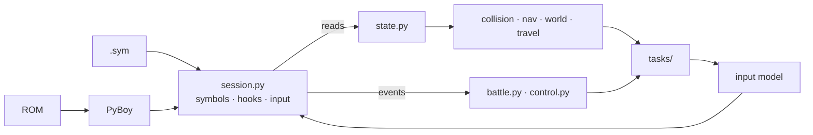
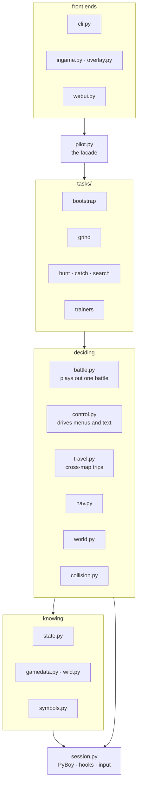
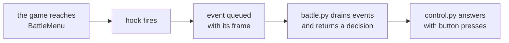
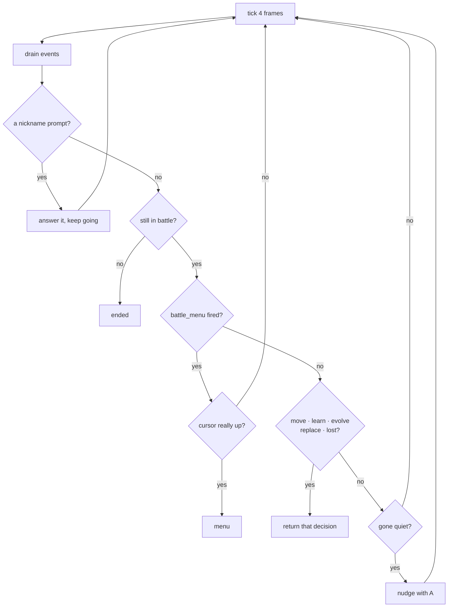
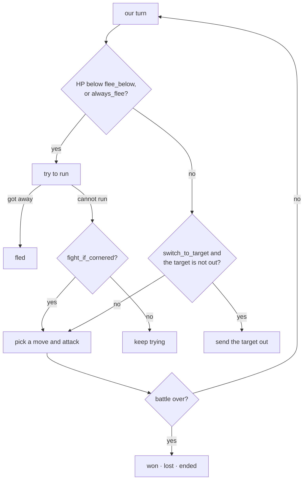
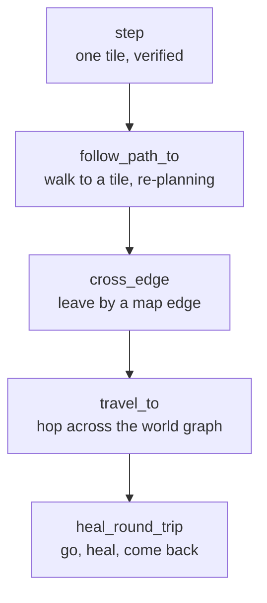
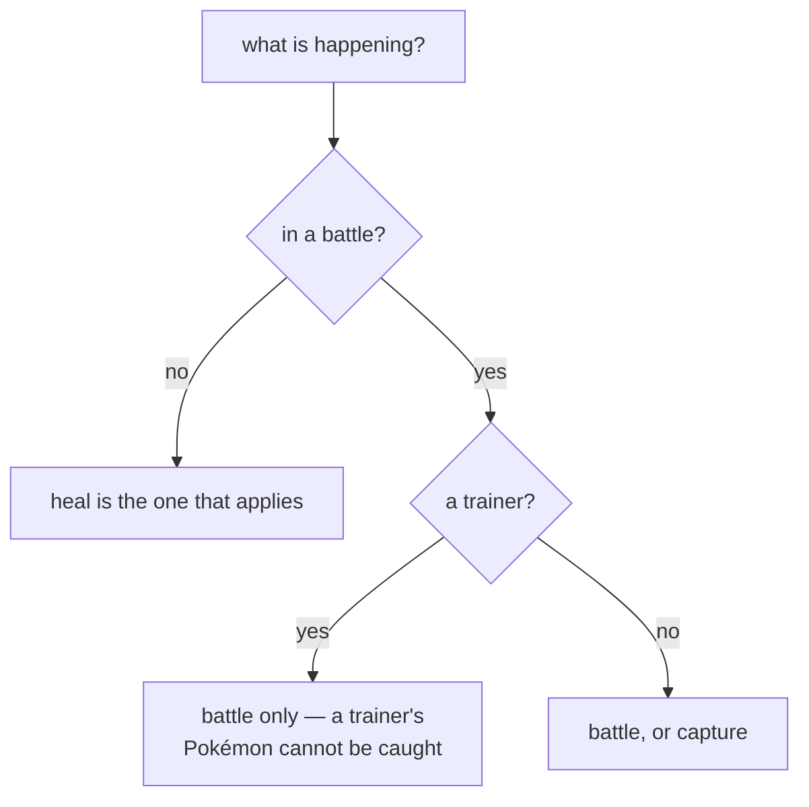
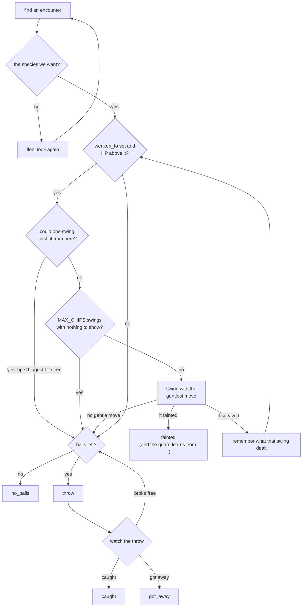
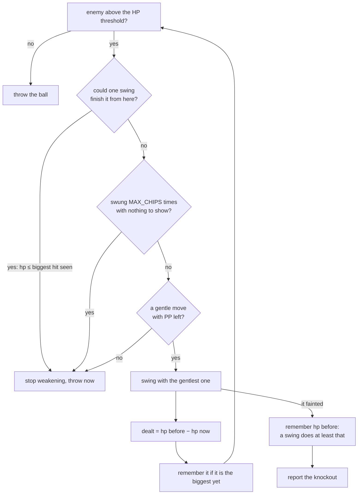
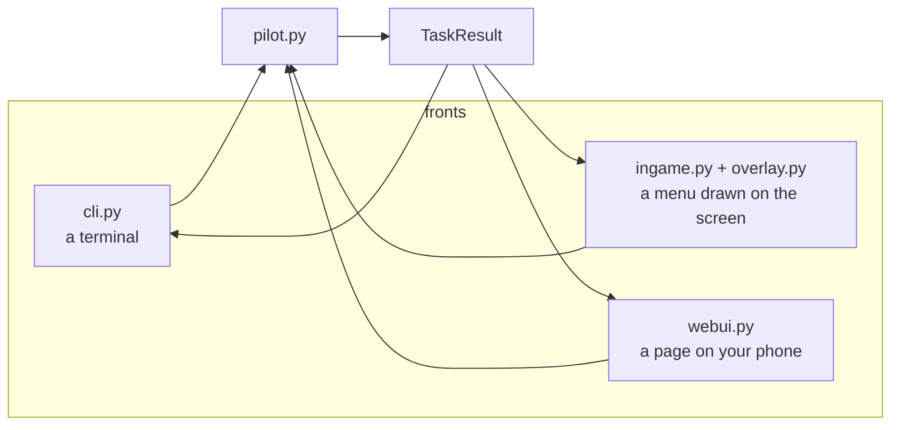

# How crystal-pilot works

An auto-pilot for Pokémon Crystal: it plays the grinding for you, on a real ROM,
in a real emulator. This document explains the code and the decisions inside it.

## How to read this

The main text is written for someone who has not seen this codebase before. You
should not need to know anything about Game Boy internals to follow it.

Wherever there is more to the story — a measurement, a trap, an address, a
reason the obvious approach does not work — it is folded away like this:

<details>
<summary><b>Advanced detail:</b> what goes in these</summary>

The expansions hold the things that cost time to find out: which ROM routine to
hook and why, the failure that motivated a design, and the cases where the
straightforward implementation is quietly wrong.

Skip them on a first read; come back when you need to change something.

</details>

Everything here is checked against the code rather than remembered. If a section
and the code disagree, the code is right and the section is a bug — see
[Keeping this honest](#11-keeping-this-honest).

There is a sibling project,
[crystal-pilot-mobile](https://github.com/minormending/crystal-pilot-mobile),
which runs the same idea in a phone browser. It has its own `docs/CODE.md`.
Where the two differ, the difference is almost always [section 4](#4-hooks-the-game-asks-we-answer).

## Contents

1. [The one idea](#1-the-one-idea)
2. [The shape of it](#2-the-shape-of-it)
3. [The layers, bottom up](#3-the-layers-bottom-up)
4. [Hooks: the game asks, we answer](#4-hooks-the-game-asks-we-answer)
5. [Battles](#5-battles)
6. [Moving around](#6-moving-around)
7. [The tasks](#7-the-tasks)
8. [Three ways to drive it](#8-three-ways-to-drive-it)
9. [Recording, checkpoints and backups](#9-recording-checkpoints-and-backups)
10. [Tests](#10-tests)
11. [Keeping this honest](#11-keeping-this-honest)
12. [Things that look like bugs and are not](#12-things-that-look-like-bugs-and-are-not)

---

## 1. The one idea

Two ideas, really, and the second is what makes this pleasant to work on.

**Read the game's memory, do not look at its picture.** A Game Boy game keeps
everything it knows in memory — where you are, what is in your party, how much
HP the thing in front of you has. The pokecrystal disassembly names every one of
those locations, so with a `.sym` file the pilot can ask direct questions instead
of guessing from pixels.

**Let the game say when it wants something.** PyBoy can set a callback on any ROM
routine. Hook `BattleMenu` and the game tells you the moment the battle menu
opens. Nothing has to guess, and nothing has to poll.



<details>
<summary><b>Advanced detail:</b> what hooks buy, precisely</summary>

Polling asks "is the menu up?" over and over and has to infer the answer from
memory that was not designed to answer it. The mobile port has to do exactly
that, and it is the source of nearly all of its subtleties: it identifies the
battle menu by `wMenuDataItems == 34` and `wMenuBorderTopCoord == 12`, because
the obvious signals are ambiguous — `wBattleMenuCursorPosition` holds the action
last *chosen*, and the pack parks the cursor in the same place the battle menu
does.

Here, `BattleMenu` firing *is* the answer. The equivalent bug class does not
exist.

What hooks cost: they only fire for routines in low ROM banks. `Session`
checks the bank of every hook at startup and raises rather than letting one
silently never fire — see [section 4](#4-hooks-the-game-asks-we-answer).

</details>

---

## 2. The shape of it

<!-- covers-api: pilot/session.py pilot/symbols.py pilot/state.py pilot/collision.py pilot/nav.py pilot/world.py pilot/travel.py pilot/control.py pilot/battle.py pilot/pilot.py pilot/gamedata.py @ 1e81c98f9f78 -->

Roughly 7,000 lines of Python, in layers. Arrows point from a layer to what it
depends on.



| Module | Answers |
| --- | --- |
| `session.py` | "run frames", "read memory", "what did the game just do?" |
| `symbols.py` | "where does `wPartyCount` live, and in which bank?" |
| `state.py` | "what is happening right now?" |
| `gamedata.py`, `wild.py` | "what is this species called?", "what appears here?" |
| `collision.py` | "can I stand there, and how do I get there?" |
| `nav.py` | "walk to this tile", "leave by this edge" |
| `world.py` | "which map is west of here, and where are its doors?" |
| `travel.py` | "get to Cherrygrove and heal, then come back" |
| `control.py` | "answer this text box / pick this menu entry" |
| `battle.py` | "play out this battle under this policy" |
| `tasks/` | "grind to 12", "catch a Sentret", "sweep this route" |
| `pilot.py` | assembles all of it and exposes the tasks |

<details>
<summary><b>Advanced detail:</b> two boundaries that carry their weight</summary>

**`battle.py` takes a policy, not a decision.** `BattlePolicy` is a dataclass —
`flee_below`, `always_flee`, `allow_evolution`, `learn_new_moves`,
`switch_to_target`, `fight_if_cornered` — and the engine plays out one battle
under it. A grind wants to win; a hunt wants to leave; a catch wants to weaken
and stop. All three use the same engine with different policies rather than
three battle loops that drift apart.

**Every task returns the same shape.** `TaskResult` carries
`status` (`completed | timeout | blocked | aborted | error`), a message, a stats
dict, whether the game was saved, the backup, and free-text notes. Front ends
render that rather than each one inventing its own reporting, which is why the
CLI, the in-game menu and the web UI agree about what happened.

Note `blocked` and `timeout` are distinct statuses. "I could not get there" and
"I ran out of budget" are different problems and want different responses from
whoever asked.

</details>

---

## 3. The layers, bottom up

### `session.py` — PyBoy, hooks, and the input model

<!-- covers: pilot/session.py @ 2f3acb4e9680 -->

Owns the emulator. Runs frames, reads memory, registers the hooks, and holds the
queue of events they produce.

<details>
<summary><b>Advanced detail:</b> WRAM banking, and rendering</summary>

**`0xD000–0xDFFF` is bank-switched on CGB and Crystal really does switch it** —
banks 1, 5 and 6 all occur in normal play. Unbanked reads of that window return
another bank's bytes for a good fraction of frames, which looks like random
corruption of the party and battle state. Every access in `session.py` is
bank-qualified; `WRAM_SWITCHABLE = range(0xD000, 0xE000)` is the guard.

**Rendering is a switch, not a constant.** With a window open, drawing every
frame throttles the emulator to a few hundred fps — fine for playing, far too
slow for a task that needs hundreds of thousands of frames. `set_render(False)`
during a task is the difference between 470× real time and unusable.

</details>

### `symbols.py` — where things live

<!-- covers: pilot/symbols.py @ 7c7dd58cd379 -->

Parses the `.sym` file, resolves names to bank-qualified addresses, and holds the
struct offsets (`PARTY_STRUCT`, the party-mon field layout, and so on).

It also owns `HOOK_ROUTINES`, the table of what to hook — see
[section 4](#4-hooks-the-game-asks-we-answer).

### `state.py` — what the game is doing right now

<!-- covers: pilot/state.py @ 84095bcbf982 -->

Typed reads: location, party, the battle, the bag. Every read goes through a
symbol, so nothing here contains a bare address.

<details>
<summary><b>Advanced detail:</b> the signal that is not what it looks like</summary>

**"World loaded" is not "party loaded".** The CONTINUE screen restores the party
and coordinates *before* the map exists, so waiting on party data starts pressing
buttons while still in the menus. `wMapStatus == MAPSTATUS_HANDLE`, with a
published map size, is the real signal.

**`wBalls` does not settle until a battle ends.** What this repo reports is
safe, because `catch.py` counts the balls it throws rather than differencing the
bag — but the one mid-battle `ball_count` guard in `_try_capture` cannot fire,
so running dry surfaces as a throw that cannot find a ball and the throw budget
is what actually ends the loop.

</details>

### `gamedata.py`, `wild.py` — what the cartridge knows

<!-- covers: pilot/gamedata.py pilot/wild.py @ 67d427df5017 -->

Species names, move power and type, map names, walkability tables, and which
wild Pokémon appear where — all parsed out of the **pokecrystal source tree**,
so they cannot drift from the ROM being driven.

<details>
<summary><b>Advanced detail:</b> time of day is part of the answer</summary>

`species_on(source, map, time_of_day, kinds)` takes the time because the tables
do. Route 29 trades Pidgey and Sentret for Hoothoot after dark, and a pilot
running at hundreds of times real time crosses those boundaries mid-run — so a
test that passes in the morning fails at night unless the species it looks for
is one that appears around the clock. That bit the suite once and is why the
parameter exists.

</details>

### `collision.py` — what you can walk on

<!-- covers: pilot/collision.py @ 214cdd8808a5 -->

Decodes the loaded map into "can I stand on this tile", and does breadth-first
pathfinding over it — so movement is planned rather than discovered by bumping
into things.

<details>
<summary><b>Advanced detail:</b> the decode, and the check that is not enough</summary>

The loaded map's blocks live in `wOverworldMapBlocks`; each tileset's
per-quadrant collision values sit in ROM at `wTilesetCollisionAddress`. Reading
both gives the collision byte for any tile.

`calibrate()` verifies its own arithmetic against `wPlayerTileCollision` — the
game publishes the collision of the tile the player is standing on, so the
decode can check itself rather than be trusted.

**That check is necessary and not sufficient**, and it is worth knowing why
before you extend this. A wrong offset can reproduce that one byte by luck, most
easily where the value is a common one. It was measured failing in the mobile
port, which uses the same technique: standing on a doorway mid-transition, the
true offset did not match and a fallback did, so the whole map decoded shifted
and a route that existed looked walled off. It fails by producing a *confident*
map rather than an error.

This repo is much less exposed, because `Pilot.calibrate()` settles and nudges
with a step first and so is rarely sampling a transition. But do not treat a
single match as proof: ask for the same offset twice, for the same player tile,
a few frames apart, and re-derive anything cached from a snapshot taken while
the map was still loading.

**Pathfinding avoids one-way ledges.** A ledge can be stood on; it is *leaving*
one in the hop direction that moves two tiles irreversibly, and a route that
used one could not be walked back.

</details>

---

## 4. Hooks: the game asks, we answer

<!-- covers: pilot/symbols.py pilot/session.py @ b9f91fc0b657 -->

This is the spine of the whole design. Instead of polling memory to guess what
the game wants, the pilot sets a callback on the ROM routine that *is* the
question.



Grouped by what they are for:

| Purpose | Hooked routines |
| --- | --- |
| A decision is wanted | `BattleMenu`, `MoveSelectionScreen`, `LearnMove`, `EvolveAfterBattle`, `ForcePlayerMonChoice` |
| Text is waiting | `WaitButton`, `PromptButton`, `WaitPressAorB_BlinkCursor`, `YesNoBox` |
| A battle went badly | `HandlePlayerMonFaint`, `ForcePlayerMonChoice`, `TryToRunAwayFromBattle`, `LostBattle` |
| Saving | `SaveMenu`, `SaveTheGame_yesorno`, `_SaveGameData`, `SavedTheGame` |
| **Naming — do *not* just press A** | `NamePlayer`, `GivePoke`, `PokeBallEffect.SkipPartyMonFriendBall`, `PokeBallEffect.SkipBoxMonFriendBall` |
| A sign that something went wrong | `NamingScreen` |

<details>
<summary><b>Advanced detail:</b> the naming group, and the bank limit</summary>

**The naming hooks exist because every one of those prompts is A-confirmable,
and that is precisely the problem.** Mashing A through the intro names the
player `AAAAA` — the NAME menu defaults to NEW NAME, which opens the letter
grid, where A repeatedly spells the same letter. Mashing A through a capture
gives every Pokémon a nickname typed the same way.

Each of those hooks fires *just before* its prompt, which is the only moment
there is to decide differently. `NamingScreen` is hooked but never acted on:
reaching the letter grid at all means one of the others was answered the wrong
way, so it is a diagnostic.

**The save sequence is not the obvious one.** An overworld save goes
`SaveMenu → AskOverwriteSaveFile → SaveTheGame_yesorno → _SaveGameData →
SavedTheGame`. Two traps in that: the confirm is **not** a `YesNoBox`, so the
generic yes/no hook never sees it; and the `SaveGameData` symbol is a *different
wrapper* that a normal overworld save never reaches. Hooking the obvious-looking
name would have produced a hook that silently never fires.

**PyBoy hooks only fire for routines in low ROM banks.** Everything hooked here
is in bank `0x10` or below. `Session._register_hooks` checks the bank of each
one at startup and raises with the offending names rather than letting a future
addition quietly do nothing:

```python
if bank > S.MAX_HOOKABLE_BANK:
    high.append(f"{routine} (bank {bank:#x})")
```

**Events are drained, never cleared, inside a battle.** `drain_events()` returns
and empties; `clear_events()` throws away. Using the second mid-battle loses
anything that fired between ticks, and the thing that fires between ticks is
usually the one that mattered.

</details>

---

## 5. Battles

<!-- covers: pilot/battle.py pilot/control.py @ d9256a7f9d29 -->

One engine, driven by a policy. A grind wants to win, a hunt wants to leave, a
catch wants to weaken and stop — all three are the same loop with different
`BattlePolicy` values.

### The decision pump

`next_decision()` advances the battle until it wants something, tapping through
text on the way.



Two of those branches are the interesting ones.

<details>
<summary><b>Advanced detail:</b> order matters, twice</summary>

**The nickname check comes first, before `in_battle`.** A capture *ends the
battle with the nickname box still on screen*. Check `in_battle` before the
nickname prompt and the pump returns `ended` with the box unanswered, leaving it
for the next A tap to accept with its default of YES — and you have just
nicknamed the Pokémon you caught.

**A hook firing is not the same as a menu being ready.** `battle_menu` can fire
while battle text is still up, so the pump confirms with `_await_menu_cursor()`
before calling it a decision point. Without that confirmation, directional
presses land on text and the turn silently falls back to whatever move the
cursor was left on.

That is also the deeper reason menu navigation reads the live cursor and steps
toward the target rather than counting presses from an assumed position: **Gen 2
menus wrap**, so normalising by pressing "up" three times does nothing on a
three-item list. And those cursor variables hold the *previous* value when a
menu hook fires, which is what the settle period is for.

**The quiet nudge is a narrow fix, not a general one.** If the game asks nothing
for a while, the pump presses A — but that only happens when a textbox was
entered before we started listening. It is not a substitute for a hook.

</details>

### Fight, flee, or switch



<details>
<summary><b>Advanced detail:</b> why `fight_if_cornered` exists</summary>

**Trainer battles cannot be fled.** A policy that only knows how to run will
stand in one losing HP until something faints, so `fight_if_cornered` turns "I
tried to leave and could not" into "then win instead". `TryToRunAwayFromBattle`
is hooked precisely so the pilot can tell a refused escape from a successful
one, rather than inferring it from HP that has quietly gone down.

**Switching exists because a grind trains one Pokémon.** The XP goes to whoever
is on the field, so `switch_to_target` sends the grind's subject out if the game
led with somebody else. `_switch_to` verifies with `active_slot` afterwards and
notes it rather than assuming the switch took.

**Move choice ranks by power × accuracy, not by matchup.** There is no type
chart here. Good enough to grind efficiently, and explicitly not optimal play —
listed in the README's limits for that reason.

</details>

---

## 6. Moving around

<!-- covers: pilot/nav.py pilot/world.py pilot/travel.py @ 809e673b50c8 -->

Four layers, each built on the one below.



A step is not "press the button for N frames". Fixed-length presses go wrong in
both directions: too short and the press is spent turning, too long and you take
a second step into grass you did not plan for.

<details>
<summary><b>Advanced detail:</b> edge tiles, and the exploratory fallback</summary>

**A connection spans only part of a shared edge**, so `cross_edge` walks to
walkable edge tiles **centre-out** and tries to step off each one. With a
collision map it plans the route to each candidate, which matters because routes
are full of one-way ledges — an exploratory walker can drop down one and strand
itself in a region with no way back up.

**There is a fallback for when the decode is not trusted.** `cross_edge` checks
`self.collision.calibrated` and drops to `_cross_edge_explore` if not, rather
than pathfinding against a map it does not believe. Note that flag is from the
*last* calibrate call, not a fresh one — see the caution in
[`collision.py`](#collisionpy--what-you-can-walk-on).

**The world graph is parsed from the disassembly, not the ROM.** `map_attributes`
gives edge connections; `warp_events` in each `maps/<Name>.asm` gives the doors.
Together they answer "how do I get from this route to the nearest Pokémon
Center", which is what makes unattended healing possible. The mobile port reads
the same relationships out of the cartridge instead, because a phone has the ROM
and the `.sym` and no source tree.

**Healing is a round trip on purpose.** `heal_round_trip` goes, talks to the
nurse, and comes back to where it was working. Ending the trip at the Pokémon
Center would leave a grind standing in a town with no grass in it — which is
exactly the bug the mobile port shipped and had to fix.

</details>

---

## 7. The tasks

<!-- covers: pilot/tasks/base.py pilot/tasks/grind.py pilot/tasks/hunt.py pilot/tasks/catch.py pilot/tasks/search.py pilot/tasks/bootstrap.py pilot/tasks/trainers.py @ 15849e9edc3d -->

Every task returns a `TaskResult`: a status, a message, a stats dict, whether the
game was saved, and notes. Front ends render that shape rather than inventing
their own.

| Task | Does |
| --- | --- |
| `bootstrap` | plays a brand-new game up to where grinding is possible |
| `grind` | trains one Pokémon to a target level on the current route |
| `hunt` | searches the route for a species and hands you the battle |
| `catch` | the same search, then weakens and throws |
| `trainers` | sweeps every trainer on a route |
| `search` | the wild-encounter loop `hunt` and `catch` share |

### Three that act on where you already are

<!-- covers: pilot/tasks/moment.py @ d76ca89aa3cf -->

Every task above goes *looking* for something. These do the obvious thing with
the situation in front of you and take no target:

| Command | Does | Refuses when |
| --- | --- | --- |
| `battle` | plays out the battle you are in, wild or trainer | you are not in one |
| `capture` | weakens and throws at the wild Pokémon you are facing | not in a battle · it is a trainer's · party full · no balls |
| `heal` | walks to the nearest heal place and comes back | you are in a battle · no party |



None of them contain new game logic: the battle engine, the capture loop and the
Pokémon Center round trip already existed and are used exactly as the searching
tasks use them.

<details>
<summary><b>Advanced detail:</b> the one thing that had to be detected, not assumed</summary>

**`capture` subclasses `CatchTask`** rather than copying it. `_try_capture`,
`_pick_ball`, `_chip` and `_watch_throw` are the parts that matter and they are
identical; the only difference is that nothing is searched for first.

**`battle` has to work out whether the menu is already up.** `BattleEngine.run`
takes `menu_open`, and getting it wrong is quiet rather than loud. Invoked by
hand you are usually sitting at the battle menu, so its hook has *already*
fired — telling the engine to wait for one means waiting for an event that will
not come again. Measured on the same fixture:

| `menu_open` | reported |
| --- | --- |
| `False` | won in **0 turns** — resolved by the engine's quiet nudge, not by play |
| `True` | won in **1 turn** — the turn it actually took |

But it is not always up: run this while *"Wild HOPPIP appeared!"* is still on
screen and there is no menu yet. So the task calls the same cursor check the
engine uses internally and passes the answer, which is right in both cases.

**`flee_below` defaults to 0 here**, not the engine's 0.35. You asked for this
battle to be played out; bailing on low HP would be answering a different
question. Pass `--flee-below` to get the escaping policy.

**Weakening is guarded**, so `--weaken-to` will not knock out the thing you asked for once it has learned what one swing does — see
[Catching](#catching) for the guard itself. `capture` starts that
memory cold, which is why it does not weaken unless asked.

**`heal` reports an already-healthy party as completed**, not as an error —
nothing needed doing, which is the outcome the caller wanted. `--force` goes
anyway, which is also how the round trip gets exercised: verified travelling
`ROUTE_29 → CHERRYGROVE_POKECENTER_1F (2 hops)` and back. That took 0.1s of wall
time, which looks impossible until you remember this runs at roughly 28,000 fps
headless — about 47 seconds of game time.

</details>

### Catching



**Weakening is guarded by what it has already done.** A ball's odds turn on how
much HP is left, so weakening first is worth real balls — but a knockout loses
the target outright, and the HP threshold is not a safe stopping point on its
own. Against something small, one swing carries it from above the line straight
to zero.

`Damage` is the guard: the biggest hit one swing has been seen to land. Nothing
reads the damage formula, so that measurement is the only evidence available,
and the rule is just *never swing at something with no more HP than this*. A
knockout is a measurement too, and the most useful one — if the target had 11 HP
and one swing took all of it, a swing does at least 11. That is why a hunt keeps
one guard across every encounter rather than one per battle: the first target is
the swing that cannot be guarded, and losing it protects all the rest. `capture`
acts on a single battle and therefore starts cold, which is why it does not
weaken unless asked.



<details><summary><b>Advanced detail:</b> the power byte lies about eleven moves,
and they are exactly the ones you must not pick</summary>

Ranking by the move table's power byte to find something gentle has a trap in
it. Gen 2 stores the fixed-damage and one-hit-KO effects with a power of 0 or 1,
because their damage is computed rather than scaled — so sorting ascending puts
every one of them *ahead* of TACKLE. Asked for the weakest damaging move, the
obvious implementation returns GUILLOTINE:

| move | power | what it actually does |
| --- | --- | --- |
| GUILLOTINE | 0 | the whole bar |
| HORN&nbsp;DRILL, FISSURE | 1 | the whole bar |
| SUPER&nbsp;FANG | 1 | half of current HP |
| SEISMIC&nbsp;TOSS, NIGHT&nbsp;SHADE | 1 | your level, in HP |
| PSYWAVE | 1 | up to 1.5× your level |
| COUNTER, MIRROR&nbsp;COAT | 1 | twice what you just took |
| TACKLE | 35 | 35 power, scaled normally |

`UNGENTLE_EFFECTS` excludes them by effect rather than trying to rank them,
because there is no gentle version of a one-hit KO. The learned-damage guard
cannot substitute for this: it learns from the swing it just took, so a first
swing of GUILLOTINE teaches it the maximum and costs the target to do it.

Status moves are excluded too, by the `power > 0` test, for the opposite reason
— ranked by power they are the gentlest thing available and they weaken nothing,
so weakening would spend every turn until `MAX_CHIPS` achieving exactly nothing.

</details>

<details>
<summary><b>Advanced detail:</b> the weakest move, and the pump</summary>

**`--weaken-to F` picks the gentlest move available**, because the usual way to
lose a catch is to knock it out. `_chip` filters to moves that take HP off
without deciding the battle by themselves and takes the lowest-powered of those;
with none it returns `nomove` and the caller throws anyway, because a worse
throw still beats no throw. It reports what happened rather than pass/fail —
`ok | fainted | ended | nomove | stuck` — since a knockout is a measurement the
guard wants and "nothing to swing with" is not a failure at all.

**A knockout ends the battle, so `_chip` reports it as `ended`** rather than as
a zero it could read — the enemy struct is cleared before anyone gets the
chance. The caller tells a knockout from a defeat by asking whether *our* lead
is still standing, which the party still answers after the battle is over.
Getting this wrong is not loud: a live hunt reported twelve encounters, zero
balls thrown and seven Pokémon "got away", when it had in fact killed all seven
— and the guard learned nothing from any of them, so it did it again every time.

**`_watch_throw` delegates to the battle engine's pump rather than tapping A
blindly.** A stray A while the battle menu is up selects FIGHT, which leaves the
pack out of step and quietly burns a ball on the next throw.

**A knockout during weakening can be followed by learn/evolve prompts**, which
is why `_watch_throw` lets the engine settle the post-battle state and then
re-reads the situation instead of assuming the battle simply ended.

**With no balls it refuses up front** rather than hunting first and failing at
the throw — `_pick_ball` raises `LookupError` before the search starts. And a
Master Ball is never thrown unless you name it.

</details>

---

## 8. Three ways to drive it

<!-- covers: pilot/cli.py pilot/ingame.py pilot/overlay.py pilot/webui.py pilot/interactive.py @ 525a08268e4d -->

The same tasks, three front ends, one `TaskResult` shape between them.



<details>
<summary><b>Advanced detail:</b> the web UI's two rules</summary>

**It binds to the LAN behind a per-run token, and must not be port-forwarded.**
It drives an emulator on your machine; there is no authentication model beyond
the token, and it is not built to face the internet.

**The idle loop runs the game at normal speed, not as fast as it can.** Left
uncapped it ran at 127× real time while nobody was doing anything, which is both
useless and hot. `set_emulation_speed(1)` while idle, `0` — uncapped — only
inside a task.

A malformed request also used to kill the pilot: `{"frames": "fast"}` raised a
`ValueError` past the loop and into a `finally: self.stop()`, *after* the handler
had already replied `{"ok": true}`. Both the handler and the planner validate
now.

</details>

---

## 9. Recording, checkpoints and backups

<!-- covers: pilot/recorder.py pilot/timeline.py pilot/backup.py @ 159c7a5cc3aa -->

Three different things, easily confused.

| | What it is | What it is for |
| --- | --- | --- |
| `recorder.py` | a sped-up video | *looking* at what the pilot did |
| `timeline.py` | periodic save states | *resuming* from any point in that run |
| `backup.py` | copies of the `.sav` and a save state | *not losing your game* |

The video is a timelapse, not a replay: a grind is hundreds of thousands of
emulated frames, so frames are sampled. The checkpoints are the frame-exact part
— the video is for looking, the save states are for resuming, and
`timeline`/`resume` tie the two together.

<details>
<summary><b>Advanced detail:</b> why two kinds of backup</summary>

They protect against different failures. The `.sav` is the battery save — what
the game itself wrote, and what you would lose to a bad in-game save. A save
state is the whole machine, including things the `.sav` does not carry, and it
is what you want if a task leaves the game somewhere strange.

**Restoring copies the `.sav` last, after flushing SRAM.** This ordering is not
cosmetic. Loading the save state brings that moment's SRAM with it, so anything
that flushes SRAM *after* the `.sav` has been copied writes the state's bytes
over the ones just restored. The `.sav` on disk and the running machine are
routinely out of step — SRAM only changes when the game commits a save — so the
two are genuinely different bytes. Before this was fixed, a restore reported
success, logged the `.sav` it had used, and left a file that had never existed
in that backup: same party, same map, different bytes. Found by restoring a real
save and comparing hashes, which is the only way it shows.

**Pruning drops whole sets, ordered by the timestamp in the name.** Not by
mtime: `take` copies the `.sav` with `copy2`, which preserves the *source*
save's modification time, so every `.sav` backup inherits whenever the live save
was last written rather than when the backup was made. Pruning the two suffixes
independently by mtime deleted the `.sav` half of recent sets while keeping
`.sav`s from much older ones — and a half-pruned set is worse than no backup,
because the surviving `.state` makes the restore look available while the bytes
it would have used are gone.

Taking only one of them leaves a real hole, which is why `backup.py` takes both
before any task.

</details>

---

## 10. Tests

<!-- covers: run-tests tests/harness.py tests/selfcheck.py @ 9bb3e76c960e -->

```bash
./run-tests                      # everything
./run-tests -k catch             # just the matching ones
./run-tests -v                   # notes and tracebacks
./run-tests --build-fixtures     # regenerate the fixtures
```

84 tests, and they need a venv (`python3 -m venv .venv && ./.venv/bin/pip
install -r requirements.txt`).

<details>
<summary><b>Advanced detail:</b> fixtures, and two ways a test can lie</summary>

**Fixtures are generated locally and gitignored.** No ROM, save or save state is
distributed here — `--build-fixtures` makes them from your own build.

**Use the harness's `rom_copy()` rather than the shared ROM.** A test that lets
the emulator write a `.sav` beside the shared ROM mutates the fixture every
other test depends on. That happened once; `rom_copy()` exists for it.

**Beware tests that depend on the time of day.** The wild tables differ between
morning, day and night, and the pilot runs at hundreds of times real time, so
the in-game clock crosses those boundaries mid-run. A catch test that passes at
10am and fails at 10pm is not flaky — it is asking for a species that is not
there. Derive a species that appears around the clock.

</details>

---

## 11. Keeping this honest

A document that drifts is worse than no document, so the sections that describe
code carry a marker naming the files they cover and the content hash at the time
the prose was last checked:

```html
<!-- covers: pilot/nav.py pilot/collision.py @ a1b2c3d4e5f6 -->
```

Sections that describe how the modules fit together — the diagram and table in
[The shape of it](#2-the-shape-of-it) — use a second form that hashes only the
`import`, `def` and `class` lines:

```html
<!-- covers-api: pilot/nav.py pilot/world.py @ a1b2c3d4e5f6 -->
```

Such a section goes stale when the module surface changes, not when a comment
inside one of them is reworded.

`tools/docs-check` recomputes those hashes and names the sections that need
re-reading:

```bash
tools/docs-check
```

```bash
tools/docs-check --update
```

The first reports drift. The second records the current hashes, which is what you
run **after** bringing the prose back in line.

A `pre-commit` hook runs the check against staged files. Enable it once per
clone:

```bash
git config core.hooksPath .githooks
```

<details>
<summary><b>Advanced detail:</b> what this can and cannot tell you</summary>

It checks that the prose was *looked at* since the code changed. It cannot check
that the prose is correct — nothing can, short of a human reading both.

That is a deliberately modest guarantee, and it is the useful one: the failure
mode for documentation is not "someone wrote something wrong", it is "someone
changed the code and nobody remembered this file existed". A hash per section
turns that from invisible into a line of output naming the section.

Consequences worth knowing:

- **Whitespace counts** for `covers:`. Reformatting a covered file will flag its
  sections. That is the right trade: a cheap false positive beats a missed real
  one, and clearing it is one command.
- **The hook blocks rather than warns**, because a warning in a pre-commit hook
  is a warning nobody reads. The escape is printed in the failure message, and
  `git commit --no-verify` always works.
- **Section granularity is the point.** Covering the whole document with one
  hash would flag everything on every change and get switched off within a week.
  `covers-api` exists for the same reason at the other end: a section listing
  every module by content hash flags on any comment edit anywhere, so an
  unrelated commit gets blocked by drift somewhere else.
- **The scanner skips fenced code blocks.** A document explaining this marker
  format contains examples of it, and without that rule the tool rewrites its own
  documentation.

</details>

---

## 12. Things that look like bugs and are not

Each of these was investigated and turned out to be correct behaviour, or a
property of the environment rather than of this code.

| Looks like | Actually |
| --- | --- |
| Party and battle state read as random corruption | Unbanked reads of `0xD000–0xDFFF`. Crystal switches that bank in normal play; qualify the read. |
| A hook was added and never fires | It is in a ROM bank above `0x10`. `Session` raises at startup for exactly this, so if you added one and see nothing, check the error you skipped. |
| The pilot nicknamed a caught Pokémon | The nickname box is still on screen when a capture ends the battle. Something checked `in_battle` before the nickname prompt. |
| Directional presses in a battle do nothing useful | A menu hook fired while text was still up. The cursor variables hold their *previous* value at that moment; wait for the cursor. |
| Normalising a menu cursor by pressing up three times | Gen 2 menus wrap, so that is a no-op on a three-item list. Read the cursor and step toward the target. |
| A catch test passes in the morning and fails at night | The wild tables differ by time of day and the pilot crosses those boundaries mid-run. Pick a species that appears around the clock. |
| Tests mutating each other's state | Something let the emulator write a `.sav` beside the shared ROM fixture. Use the harness's `rom_copy()`. |
| The emulator runs at a few hundred fps | Rendering is on. `set_render(False)` during a task. |
| The web UI feels like it is running the game too fast when idle | It was: 127× real time. Now `set_emulation_speed(1)` when idle, uncapped only inside a task. |
